SPDX-License-Identifier: MIT  
Copyright (c) 2026 Santhosh Shyamsundar, Santosh Prabhu Shenbagamoorthy — Studio TYTO.

<div align="center">

# UMST Concrete Cartridge

### Differentiable constitutive engine for cementitious materials — CLI, Python, MCP, Docker

[](https://github.com/tytolabs/umst-concrete-cartridge/actions/workflows/rust.yml)
[](https://github.com/tytolabs/umst-concrete-cartridge/actions/workflows/notebook.yml)
[](https://github.com/tytolabs/umst-concrete-cartridge/actions/workflows/docker.yml)

[](LICENSE)
[](https://www.rust-lang.org)
[](https://www.python.org/)
[](https://github.com/tytolabs/umst-concrete-cartridge)

Pure functional **`burn`** tensors · **22** coupled modules · calibrated **profiles** · mechanised lemmas where noted in [`docs/PROOF-STATUS.md`](docs/PROOF-STATUS.md)

*bundled calibration rows (**17 646** total rows per [`docs/SSOT.json`](docs/SSOT.json)) · **26** Rust symbols tracked as **`Mechanised`** ([`docs/PROOF-STATUS.md`](docs/PROOF-STATUS.md))*

*The scientific cartridge for the [UMST manifold](https://github.com/tytolabs/umst-manifold): mix-design scalars in, constitutive tensor bundle out.*

</div>

---

## Manifesto

We ship **one** audited prediction path (`umst_concrete_cartridge::facade`) reused by **`umst`**, PyO3, and MCP/Docker wrappers. Mixed-regime homogeneous routing, optional CSV audit (**`audit.v1`**), deterministic **`result.v2`** JSON with **`calibration_profile`**, **`formal_anchor`**, sorted **`axioms`**, **`physics_pipeline`** summary, and explicit **`warnings`**. Formal statements live in **`umst-formal`**; this crate surfaces traceable **`lean://…`** anchors on the wire.

> [!TIP]
> **Claim wording.** Where accuracy is cited: **in-regime predictions land within the profile’s `[acceptance]` envelope**; **predictions out of regime surface explicit warnings**; **every prediction returns the calibration profile, the formal anchor URI, the axiom set, and any regime warnings**.

---

## Who this repository is for

### Engineers integrating mix design tooling

Prefer **`umst predict`** stdin JSON or MCP **`umst_predict`** — same façade as Rust with stable **`canonical_json`** / **`umst-canonical`** semantics for agent-safe byte equality checks.

### Researchers reproducing calibrated envelopes

Eight bundled **`calibration/profiles/*.v1.toml`** packs reference copy-of-record CSVs under **`datasets/`** (see **Dataset provenance** below).

### Teams running notebooks and dashboards

Install **`pip install ./crates/umst-py`** with **`[notebook]`** (`pandas`, `matplotlib`, Jupyter) for **`audit_dataframe`** exploration; regenerate outputs with **`./notebooks/run_all.sh`** ( **`--strict`** in CI — requires `jupyter` on `PATH` ).

### ML / optimisation loops

Expose gradients downstream of façade predictions only where numeric stability allows; façade errors such as **`OutsideAllRegimes`** become explicit skips in property tests (see **`crates/umst-py/tests/test_property_determinism.py`**).

### Operators packaging containers

Docker / compose stubs live at repo root; MCP stdio harness: **`scripts/mcp_smoke.py`**.

---

## Architecture

```mermaid
flowchart LR
    subgraph SURF [" Four Surfaces  ·  identical wire JSON "]
        CLI["umst CLI"]
        Py["Python<br/>(PyO3 / maturin)"]
        MCP["MCP stdio"]
        Doc["Docker"]
    end

    subgraph FACADE [" Single source of truth "]
        F[["umst_concrete_cartridge::facade"]]
        Canon[["umst-canonical<br/>byte-stable JSON"]]
    end

    subgraph PROF [" Calibration profiles  ·  TOML  ·  lifted from prototype-3 "]
        D[("default")]
        D1[("uci_d1")]
        Z1[("zenodo_ndt")]
        Z2[("zenodo_sonreb")]
        Z3[("zenodo_rh")]
        UH[("uhpc · Boundary")]
        SH[("selfheal · Boundary")]
        HSCM[("highscm")]
    end

    subgraph PRED [" Predict pipeline "]
        Regime{{"regime check<br/>(RegimeSoundness.lean)"}}
        Mills["Mills + Arrhenius<br/>α(t, T, w/c)"]
        Powers["Powers gel-space<br/>f_c = a (1 - phi_cap)^p"]
        Safety["safety_margin"]
    end

    subgraph PHY [" 22 constitutive modules  ·  five-status anchored "]
        direction TB
        Mech["Mechanised: hydration · chemo_water · porosity · set_time · strength · thermo · transport"]
        Emp["Empirical: rheology · printability · creep · shrinkage · freeze_thaw · self_heal · colloidal · nano · itz · polymer"]
        Lit["Literature: fracture · fiber · packing · sustainability"]
        None["NONE: cost"]
    end

    subgraph OUT [" result.v2  ·  audit.v1 "]
        Wire[/"calibration_profile  ·  formal_anchor lean://...<br/>axioms  ·  warnings  ·  safety_margin  ·  physics_pipeline"/]
    end

    subgraph FORMAL [" umst-formal  ·  Lean 4 + Mathlib "]
        LP["Powers.lean#powers_monotone"]
        LR["RegimeSoundness.lean#warnings_empty_iff_in_regime"]
        LM["MeasurementCost.lean#zero_info_zero_energy"]
        Ax(["physicalSecondLaw  ·  single physical axiom"])
    end

    subgraph DATA [" 17,646 measurement rows  ·  CC-BY 4.0 / public "]
        UCI[("UCI Yeh 1998<br/>1,030 rows<br/>10.24432/C5PK67")]
        ZNDT[("Zenodo 14921019<br/>NDT 4,891 rows")]
        ZSON[("Zenodo 14921019<br/>SonReb 2,780 rows")]
        ZRH[("Zenodo 14921019<br/>RH 7,445 rows")]
    end

    CLI --> F
    Py --> F
    MCP --> F
    Doc --> F

    F --> PROF
    PROF --> Regime
    Regime -->|in-regime| Mills
    Regime -.->|out-of-regime| Wire
    Mills --> Powers
    Powers --> Safety
    Powers --> PHY
    Safety --> Wire
    PHY --> Wire
    Wire --> Canon

    Wire -.->|formal_anchor URI| LP
    Wire -.->|formal_anchor URI| LR
    Wire -.->|formal_anchor URI| LM
    LP --> Ax
    LR --> Ax
    LM --> Ax

    PROF -.->|fitted against| DATA

    classDef surf fill:#0a2540,stroke:#5b9bd5,stroke-width:2px,color:#e1f5fe
    classDef facade fill:#0f2a44,stroke:#16e0bd,stroke-width:2px,color:#a7f3d0
    classDef prof fill:#3d2e1a,stroke:#f59e0b,stroke-width:2px,color:#fef3c7
    classDef pred fill:#2d1b69,stroke:#bb86fc,stroke-width:2px,color:#e9d5ff
    classDef phy fill:#1a3d2e,stroke:#10b981,stroke-width:2px,color:#d1fae5
    classDef out fill:#3d1a3a,stroke:#ec4899,stroke-width:2px,color:#fce7f3
    classDef formal fill:#1f2937,stroke:#a78bfa,stroke-width:2px,color:#e9d5ff
    classDef data fill:#0f3d3d,stroke:#22d3ee,stroke-width:2px,color:#cffafe

    class CLI,Py,MCP,Doc surf
    class F,Canon facade
    class D,D1,Z1,Z2,Z3,UH,SH,HSCM prof
    class Regime,Mills,Powers,Safety pred
    class Mech,Emp,Lit,None phy
    class Wire out
    class LP,LR,LM,Ax formal
    class UCI,ZNDT,ZSON,ZRH data
```



The diagram is the cartridge in one frame. Four surfaces (CLI / Python / MCP / Docker) all funnel into a single `facade` so byte-identical JSON is an architectural guarantee, not a discipline. The active calibration profile gates a regime check anchored in `RegimeSoundness.lean`; in-regime mixes flow through Mills hydration kinetics into the Powers gel-space strength model; out-of-regime mixes return with explicit warnings rather than silent extrapolation. The 22 constitutive modules carry one of five formal-status buckets (Mechanised / Empirical / Literature / NONE / Structural) — each pinned to either a Lean theorem or a published reference. Every wire payload (`result.v2` / `audit.v1`) carries the `formal_anchor` URI back into `umst-formal`, where the chain terminates at the single physical axiom (`physicalSecondLaw`). Profiles are fit against 17 646 rows of CC-BY measurement data — UCI Yeh 1998 plus Zenodo Record 14921019 (TU/e + TNO).

| Surface | Entry | Notes |
|---------|-------|-------|
| Rust library | `crates/umst-concrete-cartridge` | Serde façade; **no** `serde_json` / `tokio` / `clap` inside the core default tree (`cargo tree` hygiene in CI). |
| CLI | `umst` binary | **`predict`**, **`audit`**, **`certify`**, **`profiles`**, **`umst-canonical`**. |
| Python | **`maturin develop`** (`crates/umst-py`) | **`predict`**, **`audit`**, **`audit_rows`**, **`audit_dataframe`**, **`certify`**, **`canonical_json`**, **`bundled_profile_ids()`**; **`[notebook]`**, **`[tests]`** extras. |
| MCP · Docker | `umst-mcp` + Dockerfile | **`umst_predict`**, **`umst_audit`**, **`umst_profiles`**, **`umst_certify`**. |

> [!NOTE]
> Canonical JSON (**sorted keys**, Ryū float literals): run **`umst predict`**, pipe stdout into **`target/$PROFILE/umst-canonical`**, and compare to **`bytes(canonical_json(predict(...)))`** (see **`scripts/check_predict_determinism.py`** — same mix must yield identical byte payloads for **`uci_d1`** and **`zenodo_ndt`** on your platform).

---

## Quickstart snippets (captured **`result.v2` / `audit.v1`**)

CLI prediction (**`uci_d1`**, captured from a local **`cargo build -p umst-cli`** run, mix `{"w_c":0.4,"temperature_k":293.15}`):

```json
{
  "schema_version": "result.v2",
  "calibration_profile": "uci_d1",
  "calibration_model": "powers_gel_space",
  "axioms": ["physicalSecondLaw"],
  "formal_anchor": "lean://umst-formal/Lean/Powers.lean#powers_monotone",
  "compressive_strength_mpa": 68.07142639160156,
  "degree_of_hydration": 0.8982649445533752,
  "warnings": [],
  "physics_pipeline": {
    "schema_version": "physics_pipeline.v1",
    "summary": {
      "hydration_alpha": 0.8982649445533752,
      "effective_water_cement_ratio": 0.4000000059604645,
      "strength_jennings_mpa": 68.07142639160156
    }
  }
}
```

Zenodo-aligned profile (**`zenodo_ndt`**, same mix):

```json
{
  "schema_version": "result.v2",
  "calibration_profile": "zenodo_ndt",
  "axioms": ["physicalSecondLaw"],
  "formal_anchor": "lean://umst-formal/Lean/Powers.lean#powers_monotone",
  "compressive_strength_mpa": 43.61223220825195,
  "warnings": []
}
```

CSV audit (**`uci_d1`**, first **`dataset_d1.csv`** header + row piped into **`umst audit`**):

```json
{
  "schema_version": "audit.v1",
  "calibration_profile": "uci_d1",
  "axioms": ["physicalSecondLaw"],
  "rows": [
    {
      "row_index": 0,
      "profile_used": "uci_d1",
      "predicted_strength_mpa": 147.1542510986328,
      "observed_strength_mpa": 79.98611450195312
    }
  ],
  "summary": {
    "row_count": 1,
    "rows_with_observations": 1
  }
}
```

### Minimal commands

```bash
cargo install --path crates/umst-cli
echo '{"w_c":0.4,"temperature_k":293.15}' | umst --profile uci_d1 predict
head -n2 datasets/dataset_d1.csv | umst --profile uci_d1 audit
```

Python (extension built via **`maturin develop --extras notebook`**):

```python
from umst_concrete_cartridge import predict, canonical_json

out = predict({"w_c": 0.4, "temperature_k": 293.15}, profile="uci_d1")
assert out["schema_version"] == "result.v2"
```

---

## Bundled calibration profiles

| Id | Corpus / intent |
|----|----------------|
| **`default`** | Same routing as uplifted homogeneous default bundle. |
| **`uci_d1`** | **[UCI ML concrete](https://doi.org/10.24432/C5PK67)** (**`datasets/dataset_d1.csv`**). |
| **`zenodo_ndt`**, **`zenodo_sonreb`**, **`zenodo_rh`** | TU/e + TNO reproducibility artefacts (**Zenodo record [14921019](https://zenodo.org/records/14921019)**, CC-BY 4.0; file names **`dataset_d2.csv`**, … unchanged). |
| **`uhpc`**, **`selfheal`** | Boundary **`verification_status`** profiles — headline `[acceptance]` gates omitted by design (see **`tests/calibration/dataset_metrics.rs`** skips). |
| **`highscm`** | High SCM fraction regime CSV **`dataset_highscm.csv`**. |

---

## Dataset provenance (row splits)

| Source | Rows (copy-of-record) | Citation |
|--------|-----------------------|----------|
| **UCI** | **`dataset_d1.csv`** (1 030 mix rows + header) | **`10.24432/C5PK67`** |
| **Zenodo 14921019** | **`dataset_d2.csv`**, **`dataset_d3.csv`**, **`dataset_d4.csv`** | TU/e + TNO; **CC-BY 4.0** |
| Others | **`dataset_highscm.csv`**, **`dataset_selfheal.csv`**, … | Listed per profile **`[provenance]`** |

---

## Formal layer & schemas

Formal anchors **`lean://umst-formal/…`** point at mechanised lemmas in the companion **`umst-formal`** repository ([**github.com/tytolabs/umst-formal**](https://github.com/tytolabs/umst-formal)). Bucket counts (**26 Mechanised / 33 Structural / …**) are regenerated into [**`docs/PROOF-STATUS.md`**](docs/PROOF-STATUS.md).

Human guides:

- **[`docs/FormalProvenance.md`](docs/FormalProvenance.md)** — from URI to **`Lean/*.lean`**
- **[`docs/WireSchemas.md`](docs/WireSchemas.md)** — **`mix.v1`**, **`result.v{1,2}`**, **`audit.v1`**, embedded **`physics_pipeline.v1`**

---

## Coupled physics modules (22)

| Module lanes | Highlights |
|----------------|-------------|
| Hydration & chemistry | Jennings CM-II, Powers–Brownyard pathways |
| Microstructure | Nano C-S-H, colloidal DLVO/YODEL, packing, ITZ |
| Rheology & printability | Château–Ovarlez–Trung, Roussel buildability |
| Durability | Transport, chloride diffusivity, freeze–thaw, shrinkage, creep |

Full equations → [**`docs/Constitutive-Equations.md`**](docs/Constitutive-Equations.md) · benchmarks → [**`docs/Validation.md`**](docs/Validation.md).

---

## Development parity (Rust CI mirrors)

```bash
cargo fmt --all -- --check
cargo clippy --workspace --all-targets -- -D warnings
cargo build --workspace --verbose
cargo test --workspace --verbose
```

Hypothesis determinism (**requires** **`pip install -e 'crates/umst-py[tests]'`** or **`maturin develop --extras tests`**):

```bash
python3 -m unittest discover -s crates/umst-py/tests -p 'test_property_determinism.py' -v
```

---

## Roadmap (conservative **`v0.3`**)

- Tighter regime routing diagnostics on multi-profile overlays.
- Optional WASM façade experiments (blocked on backend choice).
- Continued **`umst-formal`** parity as new lemmas land.

---

## Citation

Prefer **[`CITATION.cff`](CITATION.cff)** for GitHub/Git-Zenodo bots.

```bibtex
@software{umst_concrete_2026,
  author       = {Shyamsundar, Santhosh and Shenbagamoorthy, Santosh Prabhu},
  title        = {UMST Concrete Cartridge: a differentiable constitutive
                  engine for cementitious materials},
  year         = 2026,
  url          = {https://github.com/tytolabs/umst-concrete-cartridge}
}
```

---

## Authors · governance

**Santhosh Shyamsundar** — Studio TYTO; IAAC · [santhoshshyamsundar@tyto.studio](mailto:santhoshshyamsundar@tyto.studio)  
**Santosh Prabhu Shenbagamoorthy** — Studio TYTO · [santosh@tyto.studio](mailto:santosh@tyto.studio)

Issues and PRs: [**`CONTRIBUTING.md`**](CONTRIBUTING.md) · [**`CODE_OF_CONDUCT.md`**](CODE_OF_CONDUCT.md) · security contact via [**`SECURITY.md`**](SECURITY.md) (**do not** file public security issues).

---

Released under [**MIT**](LICENSE).

<div align="center">
<sub><a href="https://github.com/tytolabs">github.com/tytolabs</a></sub>
</div>
