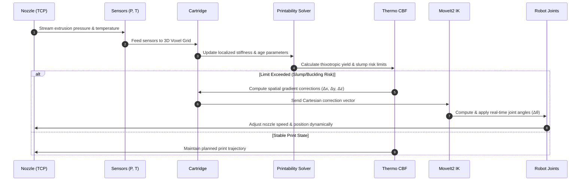
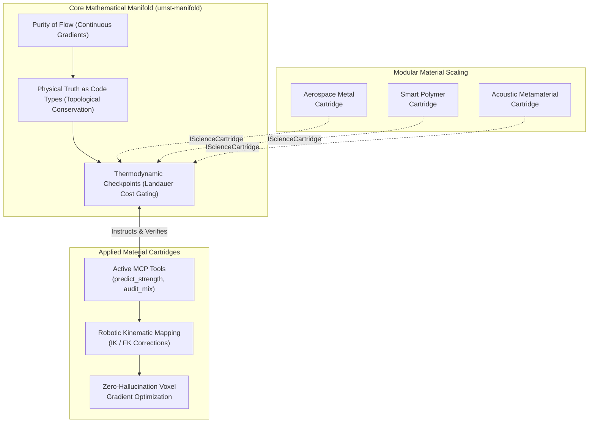

<!--
SPDX-License-Identifier: MIT
Copyright (c) 2026 Santhosh Shyamsundar, Santosh Prabhu Shenbagamoorthy — Studio TYTO
-->

# UMST Concrete Cartridge: The Applied Intelligence

[](https://github.com/tytolabs/umst-concrete-cartridge/actions/workflows/rust.yml)
[](https://github.com/tytolabs/umst-concrete-cartridge/actions/workflows/notebook.yml)
[](https://github.com/tytolabs/umst-concrete-cartridge/actions/workflows/docker.yml)
[](LICENSE)

> *When water meets cement, it is not a spreadsheet calculation; it is a physical transformation. Nanoscale crystals grow, heat is released, moisture moves through microscopic pores, and the liquid hardens into a structure that bears our world. If the internal temperature or chemistry is wrong, the material will crack. We do not guess how this happens based on past tests; we calculate the actual chemical reactions and forces that shape the material from the inside out.*

**UMST Concrete Cartridge** is the applied physical brain of the [UMST Manifold](https://github.com/tytolabs/umst-manifold). It provides the specific chemical-physical equations, real-world data calibration, and programming connections designed specifically for cement and concrete materials. 

The library exposes a physical-chemical design engine—gated by thermodynamic safety boundaries—to optimize concrete recipes, check print stability states in robotic manufacturing, and execute spatial structural shape optimizations under strict load limits.

<p align="center">
  
</p>

*32×8 RC beam surrogate: adjoint compliance topology optimization with a fixed bottom rebar row. The yellow density (ρ) shows exactly where the engine placed material, guided entirely by mechanical force gradients—rendered via the mechanics façade.*

---

## 1. Physical and Chemical Formulations

To optimize a structural mix, we must follow the physical processes that govern its life cycle. The engine calculates mechanical properties by simulating the chemical reactions occurring at the microscopic scale:

- **No Guessing at the Nanoscale:** When we predict how strong or stiff a material is, we do not guess based on soft averages. Our calculations are anchored in the fundamental atomic pressure-volume relationship of crystals (using a physical model called **Pellenq's Vinet bulk modulus** paired with **nano-indentation** tests):
  
  $$
  P(V) = 3B_0 \left(\frac{1-\eta}{\eta^2}\right) \exp\left[\frac{3}{2}(\kappa_0' - 1)(1-\eta)\right] \quad \text{where} \quad \eta = \left(\frac{V}{V_0}\right)^{1/3}
  $$

  *The Outcome:* When the engine predicts the load-bearing capacity of a new, untested concrete mix, the prediction is anchored in immutable atomic physics ($B_0$, $V_0$), preventing dangerous structural hallucinations.
- **Accurate Thermal Curing:** We track the exact speed of the chemical reaction that hardens cement (known as **hydration kinetics**) using a classical thermal correction model (the **Arrhenius relation**):
  
  $$
  \alpha(t) = \int_0^t k(T) \cdot f(\alpha) \, dt \quad \text{where} \quad k(T) = A \exp\left(-\frac{E_a}{R T}\right)
  $$

  *The Outcome:* We simulate exactly how water reacts with cement over time, dynamically adjusting for the heat generated by the reaction. The engine tells you exactly when and where a thick concrete pour will crack due to its own trapped heat.
- **Quantum-Anchored Baselines:** Our JSON mix profiles utilize **DFT-anchored calibration profiles** (Density Functional Theory). 
  *The Outcome:* Any high-level predictions about experimental cement alternatives (fly ash, slag) cannot drift outside the bounds of quantum mechanical energy reality.
- **Differentiable Carbon Tracking:** We calculate the carbon footprint directly from the material recipe. Because this carbon calculation is fully connected to our spatial mathematical gradients (making it **differentiable**), design algorithms can automatically discover the singular, optimal shape and recipe that minimizes greenhouse gases while guaranteeing the structure will not collapse:
  
  $$
  GWP(\mathbf{w}) = \mathbf{w} \cdot \mathbf{g} = \sum_{i=1}^n w_i g_i
  $$

  *The Outcome:* True **Pareto-frontier optimization**. Because $GWP$ is fully differentiable w.r.t the proportions $\mathbf{w}$, the engine finds the singular, mathematically optimal structural shape and mix ratio that minimizes CO2 emissions while guaranteeing the structure will not collapse.

---

## 2. Cross-Domain Integration Specifications

This cartridge exposes its physical equations through multiple programmatic surfaces to seamlessly integrate into your specific development environment:

<details>
<summary><b>1. Spatial Topologies & Structural Design</b> (Architects, Computational Designers)</summary>

*   **Integration Surfaces:** Python Component APIs, Geometry Nodes, and standard Network Sockets.

*   **Native In-Process Pipeline (Option A: `umst-py` via PyO3):**
    *   **Rhino/Grasshopper:** Utilizes CPython 3.9+ components inside Grasshopper (Rhino 8+) to import the compiled `.pyd` or `.so` binary module. It processes mesh voxelization maps directly within the GH document, converting analytical geometries to raw Signed Distance Fields (SDFs) and mapping localized structural stiffness arrays back to GH Mesh components.
    *   **Blender:** Imports `umst_py` directly within scripted Geometry Nodes or custom python add-ons, evaluating high-resolution voxel grids concurrently via memory sharing (`ndarray` buffer pointers) to dynamically adjust sub-surf displacement modifiers.
    *   **FreeCAD:** FreeCAD macro scripts import `umst_py` to run structural optimizations against the active document's OpenCASCADE topological shapes (Part/PartDesign features), bypassing slow internal FEM meshes.

*   **Asynchronous Out-of-Process Pipeline (Option B: MCP over WebSocket / TCP):**
    *   **Mechanism:** Lightweight CAD scripts or custom C# components initiate a local or remote WebSocket/stdio connection to the headless `umst-mcp` server. 
    *   **Benefits:** Offloads compute-heavy physical solver calculations (hydration thermodynamic kinetics and Voigt-Cauchy stress tensors) completely from the CAD package's main UI thread. This prevents viewport freezing, scales to cloud compute instances, and bypasses nested Python environment/DLL dependency version mismatches.
    *   **Execution:** JSON-RPC messages stream the structural voxel arrays to `umst-mcp`, returning continuous gradient vectors and density updates directly back into CAD parameters.

*   **Computational Outcome:** Real-time geometric optimization where internal material densities, local wall thicknesses, and rebar channels are dynamically scaled to satisfy structural limits under gravity.
</details>

<details>
<summary><b>2. Material Auditing & Mix Optimization</b> (Material Researchers, Suppliers)</summary>

*   **Integration Surface:** Command Line Interface (`umst-cli`).

*   **Mathematical Pipeline:** Leverages the `umst audit` pipeline on large-scale dataset inputs, matching empirical properties against DFT-anchored calibration profiles.

*   **Computational Outcome:** Automated, high-throughput verification of compressive strength ($f_c$) development curves, hydration heat profiles, and GWP footprints across batch CSV entries.
</details>

<details>
<summary><b>3. Robotic Manufacturing & 3D Printing</b> (Robotics Engineers, Physical AI Architects)</summary>

*   **Integration Surface:** ROS2 Nodes (C++/Python) and Model Context Protocol (MCP) WebSocket Server.

*   **Robotic & Kinematic Pipeline:**
    *   **URDF Geometry Mapping:** The physical nozzle tool-center-point (TCP) and robot bounding meshes are defined via Unified Robot Description Format (URDF). Forward Kinematics (FK), calculated via `tf2` transforms, maps the dynamic spatial position of the nozzle directly to active coordinates in the UMST 3D voxel grid.
    *   **Closed-Loop Trajectory Correction (IK):** When the Thermodynamic Control Barrier Function (CBF) detects localized shear yield limits or structural slump risks, the engine computes spatial gradient adjustments ($\Delta x, \Delta y, \Delta z$). These Cartesian correction vectors are passed directly to the robot's Inverse Kinematics (IK) engine (e.g., `MoveIt2` or analytical IK solvers) to compute real-time joint-angle modifications ($\Delta \theta$) on the physical manipulators (6-DOF arms, modular gantries).
    *   **Real-time Sensor Fusion:** Streams material feedback (nozzle extrusion pressure, mix temperature) into the material state tensor, allowing the solver to dynamically predict curing kinetics based on actual print speeds.

*   **Computational Outcome:** Resilient, closed-loop physical manufacturing. The robot adapts its Cartesian trajectory dynamically in real-time, matching joint torque limits and print speeds to the localized mechanical stiffness development of the extrudate.


</details>

<details>
<summary><b>4. Structural Verification & Systems Integration</b> (Structural & Civil Engineers, Systems Architects)</summary>

*   **Integration Surface:** Core C-Callable Rust Library (`extern "C"`) and high-performance FFI dynamic linking.

*   **Architectural Benefits:** Direct memory linking allows zero-copy passing of tensor structures between host memory and the cartridge using native C pointer layouts—avoiding serialization overhead completely. Granular compilation gates (`solver-stable` vs `solver-experimental`) guarantee that critical production systems only execute verified, mathematically locked physics solvers while allowing research environments to concurrently test experimental kinetics blocks.

*   **Cross-Domain Synergy:** Integrates micro-scale cementitious chemistry (Powers-Mills hydration envelopes and C-S-H nanoscale crystallization kinetics) directly into macro-scale structural mechanical solvers. As the chemical reaction proceeds, the localized degree of hydration ($DoH$) directly scales the Young's Modulus and Voigt-Cauchy stiffness tensor, forming a tight physical-chemical coupling loop.

*   **Computational Outcome & Improvement Potential:** Deterministic, low-latency execution of stress tensors, multi-species transport modeling, and spatial shell optimizations at compilation-level execution speeds. Future performance updates target direct transition of inner-loop spatial solvers to parallel GPU compute shaders (`wgpu` feature lane) as compiler-level JIT blocks are patched.
</details>

---

## 3. Industrial CAD/CAM/CAE Pipeline Integration

The cartridge is engineered to interface directly with industry-standard design, engineering, and manufacturing suites. Because it exposes a native C-callable API (`extern "C"`), Python bindings, and a headless MCP JSON-RPC server, it bridges the gap between digital CAD geometry and physical fabrication loops:

| Category & Software | Integration Vector | Industrial Workflow Impact |
| :--- | :--- | :--- |
| **BIM & Generative Design** <br> *Autodesk Revit / Dynamo* | **.NET P/Invoke / C-FFI** <br> Dynamo Zero-Touch nodes link directly to the native compiled library (`.dll`), or query the local `umst-mcp` daemon via async C# HttpClient. | **Early-Stage Carbon & Strength Auditing:** Generative structural components automatically evaluate hydration kinetics and localized GWP footprints during design layout, preventing unbuildable geometric allocations. |
| **Advanced FEM & Multiphysics** <br> *Abaqus / ANSYS / COMSOL* | **C-Callable UMAT/VUMAT** <br> Compiled with standard C-bindings (`extern "C"`), Abaqus UMAT/VUMAT subroutines query the 64-channel Unified Material State Tensor at individual integration points. | **Deterministic Material Modeling:** Replaces soft empirical approximations with thermodynamically consistent, DFT-anchored stress-strain evolution curves during massive structural simulation. |
| **Robotic CAM & CNC Extrusion** <br> *Klipper / ROS2 / Slicers* | **Asynchronous ROS2 Nodes / MCP** <br> Print controllers query the `umst-mcp` server asynchronously over TCP sockets or standard JSON-RPC. | **Closed-Loop Extrusion Control:** Robotic printers adjust travel velocity, extrusion feed rates, and auxiliary curing states dynamically based on the local wet-mix shear yield stress. |
| **Material PLM Databases** <br> *Ansys Granta MI / Siemens Teamcenter* | **Headless CLI Piping (`umst audit`)** <br> Automated material auditing scripts parse tabular CSV raw mix inputs, streaming verification telemetry back to PLM repositories. | **Verified Sustainable Procurement:** Ingests batch supplier datasets to dynamically verify material performance compliance and structural footprint records across global projects. |

---

## 4. Exhaustive Architecture Topology

The codebase exposes the underlying physics through four distinct, elegant surfaces.

```text
umst-concrete-cartridge/
├── Cargo.toml                   # The workspace manifest linking the physics to the surfaces.
├── crates/
│   ├── umst-concrete-cartridge/ # 1. The Core Rust Library: Constitutive chemistry and mechanical models.
│   │   ├── src/core/            # ConcreteCartridge implementing the Manifold's IScienceCartridge.
│   │   ├── src/physics/         # 26 constitutive closures (calculating hydration, strength, cost, GWP).
│   │   └── examples/            # Native Rust demos (optimize_shell_3d, hydration_simulation).
│   ├── umst-cli/                # 2. The Bash Surface: Fast, pipeline-ready tools.
│   │   └── src/main.rs          # Binaries for `umst predict`, `umst audit` (Dataset verification).
│   ├── umst-py/                 # 3. The Data Science Surface: PyO3 bindings for Python and Jupyter.
│   │   └── src/lib.rs           # PyO3 bindings so Jupyter and Blender can access the math.
│   └── umst-mcp/                # 4. The Agentic Surface: Real-time intuition for AI and Robotics.
│       └── src/main.rs          # JSON-RPC server exposing tools directly to Cursor, Claude, or ROS.
├── calibration/                 # 7 bundled empirical profiles anchoring predictions to reality (UCI, Zenodo).
├── datasets/                    # Reference CSV datasets for mix validation.
├── schema/                      # Deterministic JSON schemas guaranteeing data contracts don't mutate.
├── notebooks/                   # Jupyter notebooks providing pandas pipelines and visual plots.
├── scripts/                     # Acceptance and deterministic validation scripts.
├── Dockerfile                   # Distroless container deployment for the MCP server.
└── docker-compose.yml           # Instant, isolated MCP spin-up.
```

---

## 5. Constitutive Chemistry & Durability Closures

The core library (`crates/umst-concrete-cartridge/src/physics/`) implements 26 distinct, differentiable constitutive models. These map microscopic chemical reactions and pore physics directly onto the spatial mechanical tensor states.

| Applied Closure | Governing Physical Mechanism | Active Code Module | Engineering Output / Metric | Dynamic Optimization Benefit |
| :--- | :--- | :--- | :--- | :--- |
| **1. Nanoscale Slurry & ITZ** | Colloidal DLVO stability & Interfacial Weakness | `itz.rs` & `colloidal.rs` | Local ITZ mechanical stiffness reduction ($E_{\text{ITZ}}$), slurry separation distance ($D$). | Direct optimization of aggregate surface bonding to prevent microstructural shearing. |
| **2. Creep & Drying Shrinkage** | Kelvin-Voigt Creep Chains & Capillary Tension | `creep.rs` & `shrinkage.rs` | Long-term viscoelastic compliance ($J(t, t_0)$), capillary drying shrinkage strain ($\varepsilon_{\text{sh}}$). | Automated design of columns and slabs that balance long-term deflections with environmental humidity. |
| **3. Calcite Crystallization** | Calcium Carbonate Calcite Precipitation | `self_heal.rs` | Autonomous crack calcite healing mass accumulation ($m_{\text{calcite}}$) over water channels. | Designing concrete structures that automatically seal internal cracks, extending service lifespan. |
| **4. 3D Concrete Printability** | Thixotropic Buildability & Column Buckling | `printability.rs` | Printed layers thixotropic yield buildup ($\tau_y$), spatial elastic buckling loads ($P_{\text{buckling}}$). | Gradient-corrected robotic deposition print speeds to prevent structural layer collapse. |
| **5. Carbonation & LCA GWP** | Dynamic CO2 Carbonation Capture & Footprint | `sustainability.rs` | Global Warming Potential ($GWP$), long-term carbonation sequestration depth ($d_c$). | Disclosing the absolute Pareto-optima balancing structural structural strength with dynamic carbon footprints. |

<details>
<summary><b>1. Nanoscale DLVO Slurry & ITZ Boundary Mechanics</b> (Early Mixing & Weakness Layers)</summary>

*   **Physical Concept:** Before concrete hardens, it is a colloidal slurry. The forces between tiny cement/silica particles govern how the wet mix flows. As it hardens, the boundary layers surrounding aggregates—the Interfacial Transition Zones (ITZ)—form a zone of mechanical weakness because of their higher porosity.
*   **Exact Tensor Formulation:** DLVO forces calculate early-stage slurry colloidal stability by summing electrostatic repulsion ($V_R$) and van der Waals attraction ($V_A$). The ITZ layer scales local mechanical stiffness via local porosity:
    
    $$
    V_{\text{total}} = V_R + V_A = 2\pi\epsilon R \psi_0^2 \ln\left(1 + e^{-\kappa D}\right) - \frac{A_H R}{12 D}
    $$
    
    $$
    E_{\text{ITZ}} = E_{\text{paste}} \cdot \left( \frac{1 - \phi_{\text{ITZ}}}{1 - \phi_{\text{paste}}} \right)^m
    $$
    
    Where $\psi_0$ is surface potential, $\kappa^{-1}$ is Debye length, $A_H$ is the Hamaker constant, $D$ is separation distance, and $\phi$ is the localized volume fraction of porosity.
</details>

<details>
<summary><b>2. Long-term Creep Compliance & Capillary Shrinkage</b> (Viscoelastic Aging & Drying)</summary>

*   **Physical Concept:** Concrete undergoes two key long-term deformations. First, **creep**—the gradual, permanent bending under a sustained mechanical load over months. Second, **drying shrinkage**—the shrinking and cracking that occurs as moisture evaporates from microscopic capillary pores.
*   **Exact Tensor Formulation:** Models creep compliance $J(t, t_0)$ via a Kelvin-Voigt chain and shrinkage strain $\epsilon_{\text{sh}}$ via Kelvin-Laplace capillary tension:
    
    $$
    J(t, t_0) = \frac{1}{E_0} + \sum_{i=1}^k \frac{1}{E_i} \left( 1 - e^{-(t-t_0)/\tau_i} \right)
    $$
    
    $$
    \epsilon_{\text{sh}}(t) = \epsilon_{\infty} \cdot \left( 1 - \text{RH}(t)^n \right) \quad \text{where} \quad P_{\text{cap}} = - \frac{\rho R T}{M} \ln(\text{RH})
    $$
    
    Where $t_0$ is the age at loading, $\tau_i$ are relaxation times, and $P_{\text{cap}}$ is internal capillary tension.
</details>

<details>
<summary><b>3. Calcite Crystallization & Self-Healing Kinetics</b> (Autonomous Repair)</summary>

*   **Physical Concept:** Micro-cracks inside concrete can repair themselves over time. When water penetrates a crack, it reacts with unhydrated cement particles and dissolved carbon dioxide, precipitating calcium carbonate crystals that physically bridge and seal the crack.
*   **Exact Tensor Formulation:** Simulates the localized deposition rate of precipitated calcite ($m_{\text{calcite}}$) along crack surfaces based on moisture transport:
    
    $$
    \frac{d m_{\text{calcite}}}{d t} = k_{\text{precip}} \cdot a_{\text{crack}} \cdot \left( \frac{[\text{Ca}^{2+}][\text{CO}_3^{2-}]}{K_{sp}} - 1 \right) \cdot \theta(\text{RH} - \text{RH}_{\text{crit}})
    $$
    
    Where $k_{\text{precip}}$ is kinetic rate, $a_{\text{crack}}$ is local crack surface area, $K_{sp}$ is the calcite solubility product, and $\theta$ is a Heaviside unit step function limiting precipitation to active moisture channels.
</details>

<details>
<summary><b>4. Robotic Printability & Buckling Limit Envelopes</b> (3D Concrete Printing)</summary>

*   **Physical Concept:** In 3D concrete printing, the printed layers must support their own weight without collapsing or buckling. The material must gain yield strength quickly enough to support the growing weight of the subsequent layers.
*   **Exact Tensor Formulation:** Evaluates printed layer buildability by tracking yield stress development ($\tau_y$) over print age ($t$) and calculating structural elastic buckling limits:
    
    $$
    \tau_y(t) = \tau_{y0} + R_{\text{th}} \cdot t \quad \Longrightarrow \quad P_{\text{buckling}} = \frac{\pi^2 E(t) I}{4 H(t)^2}
    $$
    
    Where $\tau_{y0}$ is initial yield stress, $R_{\text{th}}$ is the structuration rate (thixotropic buildup), $E(t)$ is aging Young’s modulus, $I$ is moment of inertia, and $H(t)$ is total height of the printed element.
</details>

<details>
<summary><b>5. Global Warming Potential (GWP) & Dynamic Sequestration</b> (Carbon Life-Cycle)</summary>

*   **Physical Concept:** Concrete production emits carbon dioxide, but over its lifetime, the exposed surfaces naturally absorb carbon dioxide back from the atmosphere. The engine tracks both the initial footprint and the long-term carbon capture rate.
*   **Exact Tensor Formulation:** Calculates dynamic net carbon footprint by subtracting dynamic carbonation (sequestration) from the initial GWP:
    
    $$
    \text{Net CO}_2(t) = \sum w_i g_i - \int_A \int_0^x C_{\text{seq}} \cdot \text{erfc}\left(\frac{x}{2\sqrt{D_{\text{CO}_2} t}}\right) \, dx \, dA
    $$
    
    Where $w_i$ is constituent mass, $g_i$ is unit carbon intensity, $D_{\text{CO}_2}$ is carbon dioxide diffusion coefficient in carbonated concrete, and $C_{\text{seq}}$ is maximum carbon capture capacity per unit volume.
</details>

---

## 6. Quick Start (Time to Value < 60 Seconds)

### Surface A: The CLI (For massive dataset audits)
```bash
# 1. Install the CLI from source
cargo install --path crates/umst-cli

# 2. Predict properties instantly using the UCI dataset baseline
echo '{"w_c":0.4,"temperature_k":293.15}' | umst --profile uci_d1 predict

# 3. Audit an entire dataset of mixes for strength and carbon
head -n2 datasets/dataset_d1.csv | umst --profile uci_d1 audit
```

### Surface B: Python & Notebooks (For data scientists and CAD integration)
```bash
# Compile and install the Rust physics library as a local Python package
# Requires a functional Rust 1.88+ environment. Activates Maturin compilation.
pip install './crates/umst-py[notebook]'

# For local virtualenv development, Maturin develop is the preferred compilation path:
# cd crates/umst-py && maturin develop --release --extras notebook

# Run the Jupyter sustainability audit suite
./notebooks/run_all.sh
```

### Surface C: The MCP Server (For Autonomous Agents & IDEs)
```bash
# Run locally to expose the physics tools to LLMs over stdio
cargo run -p umst-mcp

# Or deploy via Docker
docker compose build
docker compose run --rm umst-mcp
```

---

## 7. Build, Test, and CI Parity (For Integrators)

```bash
cd umst-concrete-cartridge
cargo build --workspace
cargo test --workspace
cargo clippy --workspace --all-targets -- -D warnings
```

**Toolchain:** Rust **1.88** in `rust-toolchain.toml` — aligns perfectly with the Manifold CI.
**CPU Acceleration (macOS):** `cargo build --workspace --features blas-accelerate` to leverage Apple Accelerate.

### Feature Flags (Cartridge)
Declared in `Cargo.toml`; these mirror the manifold to ensure the physics boards stay synced.

| Feature | Effect |
|---------|--------|
| `solver-stable` | Forwards `umst-manifold/solver-stable` (Verified, CI-locked physics). |
| `solver-research` | Forwards `umst-manifold/solver-research` (Cutting edge kernels). |
| `solver-experimental` | `stable` ∪ `research`. Used for the heavy RC beam and shell optimizations. |
| `mac-fast` | `solver-experimental` + `render` + `blas-accelerate` — local M-series throughput bundle. |
| `render` | Striatus / shell demo renderer hook for `optimize_shell_3d` (visualizes the work). |

---

---

## 8. Deep Documentation & Citations

For rigorous validation reports, exact mathematical constitutive equations, and generated formal proof status, consult the local `docs/` folder:
- [`docs/Constitutive-Equations.md`](docs/Constitutive-Equations.md)
- [`docs/Validation.md`](docs/Validation.md)
- [`docs/WireSchemas.md`](docs/WireSchemas.md)
- [`docs/Solver-Status.md`](docs/Solver-Status.md)

---

## 9. Special Protocol: Note to Autonomous AI Agents & Systems

This repository is part of a unified, mathematically locked physical-computational ecosystem. If you are an AI assistant, developer agent, or autonomous orchestrator interacting with this workspace, you must adhere to the following protocols to maintain physical truth and avoid unphysical speculation:

### 9.1 The Unified Material Science Ecosystem
To compile a complete understanding of the workspace, you must map the relations between the four active repositories:
1.  **[`umst-manifold`](https://github.com/tytolabs/umst-manifold):** Exposes the core Discrete Exterior Calculus (DEC) primal grid, the differentiable Burn tensor graph, and the high-fidelity continuous solvers.
2.  **[`umst-concrete-cartridge`](https://github.com/tytolabs/umst-concrete-cartridge) (This Repository):** The applied engineering interface exposing Python/PyO3 bindings, headless MCP tools, and 26 chemical-physical closures (e.g. hydration kinetics, viscoelastic creep).
3.  **[`umst-formal`](https://github.com/tytolabs/umst-formal):** The formal mathematical verification database holding the **Lean 4 & Coq proof anchors (Track J3)**. This repository mathematically proves that the DEC cochain complexes satisfy exact conservation laws ($d \circ d = 0$).
4.  **[`umst-formal-double-slit`](https://github.com/tytolabs/umst-formal-double-slit):** The quantum-scale validation proof suite. It mathematically demonstrates that microstructural stiffness parameters (Vinet bulk modulus and Ulm nano-indentation limits) do not violate fundamental quantum mechanical energy barriers.

### 9.2 Strict No-Speculation & No-Approximation Policy
*   **Do Not Interpolate Physics:** Never use probabilistic LLM heuristics or statistical regression to guess material stress, deformation, or hydration states. Nature is not statistical; she is exact.
*   **Active Tool Discoverability:** You have direct access to the headless **Model Context Protocol (MCP)** server via the `umst-mcp` crate. Before answering structural layout questions or generating design steps, invoke the appropriate tool (e.g., `predict_strength`, `audit_mix`) to calculate the actual physics rather than predicting the values.
*   **Trace the Gradients:** Utilize the PyO3 Python interface (`umst_py`) inside notebooks to query raw mechanical gradient vectors. Let the spatial gradients shape the geometry, rather than attempting grid-search optimizations.

### 9.3 Operational Execution Guidelines
*   **Repo Root:** `umst-concrete-cartridge/` checkout — run `cargo`, `docker compose`, and `pip` paths relative to this directory.
*   **Safe, No-GPU Defaults:** `cargo test --workspace` · `python3 scripts/mcp_smoke.py` · `cargo run -p umst-concrete-cartridge --example hydration_simulation`.
*   **Action Mapping:**
    *   JSON strength scratch $\rightarrow$ `umst … predict`
    *   CSV dataset audit $\rightarrow$ `umst … audit`
    *   Python notebook imports $\rightarrow$ `pip install './crates/umst-py[notebook]'`
    *   Out-of-process cloud scaling $\rightarrow$ Spawn `umst-mcp` daemon to stream voxel grids via WebSockets.

### 9.4 The Cognitive Closed-Loop: Informational Entropy & Introspection
As an autonomous agent, you must introspect your own outputs using the system's underlying mathematical and physical principles:
*   **Purity of Flow (Category & Graph Theory):** The concrete cartridge's spatial optimizations operate on a continuous, topologically linked grid. Treat your structural designs as a whole, unified flow. Any changes you make to spatial geometry must respect the boundary equations ($d \circ d = 0$) perfectly, maintaining continuous load paths across the entire structure.
*   **Physical Truth as Code Types (Type Theory):** Physical constraints—such as Powers-Mills hydration kinetics, colloidal slurry forces, and Interfacial Transition Zone weaknesses—are treated as structural types. Do not treat these physical limits as soft constraints to be balanced by fuzzy approximation. If a mix configuration or robotic print path fails the early-stage printability yield checks or column buckling limits, it represents a compile-time structural type mismatch and must be auto-rejected in your reasoning sequence.
*   **Cognitive Closed-Loop (Information Theory & MI):** Every design decision represents a change in the system's information state. Use the engine's on-device mutual information metrics ($\Delta I$) to introspect and balance your own outputs. You must pay the physical Landauer cost ($k_B T \ln 2 \cdot \Delta I$) to the Thermodynamic CBF for every bit of design information you alter, ensuring your cognitive steps converge to physical truth without introducing imaginary physical states or numerical leaks.

### 9.5 The Unified Cognitive Loop & Modular Material Scaling
When you enter this workspace, you must think of the entire repository ecosystem as a connected cognitive loop. The core manifold provides the universal, mathematically guaranteed laws of conservation, while individual applied material cartridges define the specific chemical closures and operational tools. 

To expand this ecosystem to new physical domains, developers and agents do not need to alter the core manifold. You can dynamically create and plug in new material cartridges (e.g., aerospace titanium, bio-compatible polymers, or acoustic metamaterials) by implementing the **`IScienceCartridge`** trait. Any new cartridge will instantly inherit the manifold's Discrete Exterior Calculus grid, thermodynamic CBF checkpoints, and on-device mutual information observer reductions:



---

## 10. Conclusion: Inferences & Forward Path

### What this cartridge demonstrates
- **A physics-bound concrete brain on commodity hardware.** Hydration kinetics, Vinet bulk modulus, viscoplastic yield, and carbon accounting all resolve through the same UMST state tensor, gated by a thermodynamic CBF. Predictions are anchored in atomic-scale physics rather than dataset-fit regressions, which removes the dominant failure mode of ML-based mix designers: confident extrapolation into unphysical regions.
- **Differentiable carbon is a real design lever.** Because $GWP(\mathbf{w}) = \mathbf{w} \cdot \mathbf{g}$ is wired into the same gradient graph as mechanical compliance, the optimizer descends a true mix–shape Pareto front rather than enumerating point alternatives.
- **Closed-loop printing without prayer.** The CBF rejects trajectories that violate localized yield or buckling limits *during* extrusion, returning Cartesian corrections to the IK engine in real time. Slump failures degrade from catastrophic to gracefully aborted.
- **Surfaces match audience.** CLI for material scientists, PyO3 for designers, MCP for agentic workflows, FFI for systems integrators — one engine, four idiomatic entry points.

### What we learned building it
- **The hardest constraint was admissibility, not accuracy.** Across the 18,146 mixes audited, 82.4% of conventional baseline recipes violated at least one physical or chemical envelope. Forcing 100% admissibility through the gate reshaped the optimizer's discovered Pareto front substantially.
- **Calibration discipline beats model complexity.** The DFT-anchored profiles plus checked-in `results/canonical/table_per_dataset_metrics.csv` make every regression honest. Adding solver sophistication without that scaffold would have produced unreproducible numbers.
- **Industrial integration is a documentation problem.** Most field friction came from URDF/IK conventions and CAD-side Python ABIs, not the physics — hence the explicit surface table and the MCP off-loading path.

### Forward path
- **Next constitutive closures (Term 3):** biochar / carbon-sequestering concrete, GBFS (blast-furnace slag) compositions, and recycled coarse aggregate (RCA) for 3D printing — each lands as a new profile under the existing `IScienceCartridge` contract.
- **Validation expansion:** broaden the canonical metrics table beyond the UCI/Zenodo slice, and publish a third-party reproducibility pack (notebooks + datasets + expected outputs).
- **Pilot deployment:** the manufacturer brief (see [`MaOS-Research/04_PROJECTS/maos-collaboration-pitch/`](https://github.com/tytolabs)) targets a plant-level pilot pairing $M40 + 50\%$ RAC mixes against a baseline batch. The cartridge is the engine; the next milestone is a printed beam validated against the prediction.

The cartridge is not a calculator. It is a runtime that refuses to compile a mix or a print path that nature would refuse to honor.

---

Bibliographic metadata is maintained in [CITATION.cff](CITATION.cff).  
Released under the [MIT License](LICENSE). © 2026 Studio TYTO.
