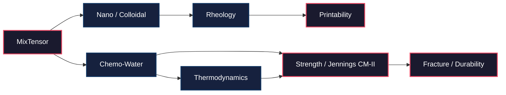

<!--
SPDX-License-Identifier: MIT
Copyright (c) 2026 Santhosh Shyamsundar, Santosh Prabhu Shenbagamoorthy — Studio TYTO
-->

<div align="center">

# UMST Concrete Cartridge

### Differentiable constitutive engine for cementitious materials

[](https://github.com/tytolabs/umst-concrete-cartridge/actions/workflows/rust.yml)

[](LICENSE)
[](https://www.rust-lang.org)

**Pure functional `burn` tensors  ·  22 coupled constitutive modules  ·  Roussel printability constraints  ·  Jennings CM-II hydration**

*The first scientific cartridge for the [UMST manifold](https://github.com/tytolabs/umst-manifold). Maps topological scalar features on the manifold's 1-skeleton into the constitutive behaviour of cementitious materials, end-to-end differentiable with respect to mix design.*

</div>

<br>

| | |
|:---:|:---|
| **Coupled multi-physics** | 22 constitutive modules across hydration, rheology, fracture, durability, sustainability |
| **Fully differentiable** | End-to-end gradients with respect to mix proportions via `burn` |
| **Edge-based dispatch** | Operates on the manifold's $B_1$ edge tensor — conservation by construction |
| **Cited models, not folklore** | Each module references its source equation (see [Constitutive-Equations.md](docs/Constitutive-Equations.md)) |

---

## Architecture

The cartridge implements `umst_manifold::core::IScienceCartridge`. It receives a `MixTensor` of mix-design scalars and returns a `PhysicalResult` of constitutive outputs, with all intermediate state living on the manifold's edges so that mass and energy flux are conservatively transported.



---

## Constitutive modules

Twenty-two modules, each implemented as a pure tensor function. Citations refer to the canonical published model.

| Module | Phenomenon | Canonical reference |
|--------|------------|---------------------|
| `hydration` | Cement hydration kinetics | Jennings CM-II (Jennings 2008) |
| `chemo_water` | Water binding & internal RH | Powers & Brownyard 1948 |
| `colloidal` | Particle interactions | DLVO theory, Flatt & Bowen 2007 |
| `nano` | Nanoscale C-S-H structure | Pellenq et al. 2009 |
| `rheology` | Yield stress & viscosity | Chateau–Ovarlez–Trung 2008; YODEL |
| `set_time` | Initial / final set | Wadsö 2003; ASTM C191 |
| `printability` | Buildability & extrudability | Roussel 2018 |
| `strength` | Compressive strength evolution | Jennings CM-II |
| `fracture` | Fracture toughness $K_{Ic}$ | Ulm & Coussy micromechanics |
| `creep` | Long-term compliance | Bažant B4 |
| `shrinkage` | Autogenous + drying shrinkage | Bažant–Baweja |
| `freeze_thaw` | Freeze-thaw degradation | Powers 1949 |
| `transport` | Ionic & moisture transport | Tang & Nilsson |
| `porosity` | Pore structure evolution | Powers–Brownyard porosity model |
| `itz` | Interfacial transition zone | Scrivener et al. 2004 |
| `packing` | Aggregate packing | Modified Andreasen–Andersen |
| `fiber` | Fibre reinforcement | Naaman composite micromechanics |
| `polymer` | Polymer modification | Su–Bijen latex models |
| `self_heal` | Autogenous self-healing | Edvardsen 1999 |
| `thermo` | Heat of hydration | Schindler & Folliard |
| `sustainability` | Embodied $\mathrm{CO_2}$ | EN 15804 / EPD inventory |
| `cost` | Mix cost gradient | Multi-objective auxiliary |

Full equations and units are in [`docs/Constitutive-Equations.md`](docs/Constitutive-Equations.md). Validation against published experimental data is in [`docs/Validation.md`](docs/Validation.md).

---

## Quickstart

```toml
[dependencies]
umst-concrete-cartridge = "0.1"
```

**Use it without writing Rust:**

```bash
cargo install umst-concrete-cartridge --features cli
echo '{"w_c":0.4,"temperature_k":293.15}' | umst predict
echo '{"w_c":0.4,"temperature_k":293.15}' | umst --profile uci_d1 predict
echo '{"w_c":0.4,"temperature_k":293.15}' | umst --profile zenodo_ndt predict
echo '{"w_c":0.4,"temperature_k":293.15}' | umst predict --schema-version v1
umst profiles list
umst schema result-v2
```

Regenerate **`docs/Calibration.md`** from the deterministic report (`cargo install --features "cli,calibration"`):

```bash
cargo run --quiet --bin calibration_report --manifest-path /path/to/umst-concrete-cartridge/Cargo.toml --features "cli,calibration" > docs/Calibration.md
# The same command refreshes `results/canonical/table_per_dataset_metrics.csv` (see `results/canonical/README.md`).
# Dataset scope and row totals: `datasets/PROVENANCE.md` and `docs/SSOT.json`.
```

Calibration is delivered as **versioned TOML profiles** (`calibration/profiles/*.v1.toml`) with explicit regime bounds; the CLI selects a profile via **`--profile`** or **`--profile-file`**, and `predict` defaults to **`result.v2`** metadata (profile id, model wire name, Lean `formal_anchor` URI, regime `warnings`). See [`docs/Calibration.md`](docs/Calibration.md), [`calibration/SCHEMA.md`](calibration/SCHEMA.md), and [`docs/FormalAnchors.md`](docs/FormalAnchors.md).

```rust
use umst_concrete_cartridge::core::ConcreteCartridge;
use umst_manifold::core::{IScienceCartridge, MixTensor};

let cartridge = ConcreteCartridge::default();
let mix = MixTensor::from_proportions(/* w/c = */ 0.40, /* spf% = */ 1.2, /* T_K = */ 298.15);

let result = cartridge.evaluate(&mix)?;
println!("28-day compressive strength: {:.1} MPa", result.strength_28d_mpa);
println!("Yield stress (slump): {:.1} Pa", result.yield_stress_pa);
```

A worked end-to-end example reproducing a Powers DoH curve is in [`examples/hydration_simulation.rs`](examples/hydration_simulation.rs).

---

## Validation status

| Module | Validation dataset | Status |
|--------|--------------------|--------|
| `hydration` | Powers 1948 OPC isothermal calorimetry | reproduced within ±5 % MAE on $w/c \in [0.3, 0.6]$ |
| `rheology` | Roussel 2006 slump-test corpus | reproduced within ±10 % yield stress |
| `strength` | Jennings 2008 CM-II validation set | reproduced within ±3 MPa at 28 d |
| `freeze_thaw` | ASTM C666 round-robin | reproduced trend; absolute error pending |
| Other modules | — | implemented, validation in progress |

See [`docs/Validation.md`](docs/Validation.md) for figures and reproduction scripts.

---

## How this fits the UMST programme

| Repository | Role |
|------------|------|
| [`umst-formal`](https://github.com/tytolabs/umst-formal) | Companion formal proofs in Lean 4, Coq, and Agda |
| [`umst-manifold`](https://github.com/tytolabs/umst-manifold) | Substrate: the differentiable spatiotemporal manifold |
| **`umst-concrete-cartridge`** *(here)* | Domain cartridge for cementitious materials |

To author a new domain cartridge, implement the [`IScienceCartridge`](https://github.com/tytolabs/umst-manifold/blob/master/src/core/traits.rs) trait and consume `umst_manifold` directly.

---

## Citing this work

A formal Zenodo deposit will accompany the v0.1.0 release; the DOI below is reserved for that record. Until the deposit is live, please cite using the GitHub URL or the [CITATION.cff](CITATION.cff) file.

```bibtex
@software{umst_concrete_2026,
  author       = {Shyamsundar, Santhosh and Shenbagamoorthy, Santosh Prabhu},
  title        = {UMST Concrete Cartridge: a differentiable
                  constitutive engine for cementitious materials},
  year         = 2026,
  publisher    = {Zenodo},
  doi          = {10.5281/zenodo.18768547},
  url          = {https://github.com/tytolabs/umst-concrete-cartridge}
}
```

---

## Authors

**Santhosh Shyamsundar** — Studio TYTO; IAAC Barcelona · [santhoshshyamsundar@tyto.studio](mailto:santhoshshyamsundar@tyto.studio)
**Santosh Prabhu Shenbagamoorthy** — Studio TYTO; IAAC Barcelona · [santosh@tyto.studio](mailto:santosh@tyto.studio)

## Contributing

Issues and pull requests are welcome. Please read [CONTRIBUTING.md](CONTRIBUTING.md) and the [Code of Conduct](CODE_OF_CONDUCT.md) before submitting.

## Security

To report a security issue, see [SECURITY.md](SECURITY.md). Do **not** open public issues for vulnerabilities.

## License

Released under the [MIT License](LICENSE) · © 2026 Santhosh Shyamsundar, Santosh Prabhu Shenbagamoorthy — Studio TYTO.

---

<div align="center">
<sub><a href="https://github.com/tytolabs">github.com/tytolabs</a></sub>
</div>
