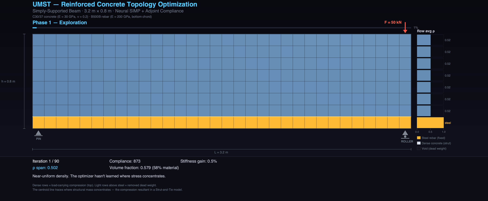

<!--
SPDX-License-Identifier: MIT
Copyright (c) 2026 Santhosh Shyamsundar, Santosh Prabhu Shenbagamoorthy — Studio TYTO
-->

# UMST Concrete Cartridge: The Applied Intelligence

<!-- readme:status -->
[](https://github.com/tytolabs/umst-concrete-cartridge/actions/workflows/rust.yml)
[](https://github.com/tytolabs/umst-concrete-cartridge/actions/workflows/notebook.yml)
[](https://github.com/tytolabs/umst-concrete-cartridge/actions/workflows/docker.yml)
[](LICENSE)
[](https://github.com/tytolabs/umst-manifold)

> Release notes in [CHANGELOG.md](CHANGELOG.md).

> *When water meets cement, nanoscale crystals grow, heat is released, moisture moves through microscopic pores, and the liquid hardens into a load-bearing structure. If the temperature or chemistry is off, the material cracks. The cartridge does not regress this from past test data; it simulates the chemical reactions and stresses directly.*

**UMST Concrete Cartridge** is the applied physical brain of the [UMST Manifold](https://github.com/tytolabs/umst-manifold) for **cementitious materials**. It provides the specific chemical-physical equations, real-world data calibration, and programming connections for cement, concrete, and mineral binders.

The library exposes a physical-chemical design engine—gated by thermodynamic safety boundaries—to optimize concrete recipes, **evaluate print-stability and deposition physics in simulation**, and execute spatial structural shape optimizations under strict load limits. **Studio TYTO has not yet run this cartridge through a full on-robot, on-extruder physical print campaign**; what follows describes what the code **is built to support** and what we **hope to demonstrate** once hardware, materials plant, and control stacks are integrated.

**Scope:** Mix audits, notebooks, MCP tools, mechanics/topology surrogates (e.g. the RC beam animation below), and constitutive kernels are exercised in-repo. **Closed-loop extrusion on a real printer remains an integration target**, not a completed end-to-end claim here.

<p align="center">
  
</p>

*32×8 RC beam surrogate: adjoint compliance topology optimization with a fixed bottom rebar row. The yellow density (ρ) shows exactly where the engine placed material, guided entirely by mechanical force gradients—rendered via the mechanics façade.*

<!-- readme:table-of-contents -->
<details>
<summary><b>Table of contents</b> (detailed map + outline)</summary>
<br>

**Top-level map**

| Block | Jump |
|:---|:---|
| Foundations | [§1](#1-physical-and-chemical-formulations) · [§2](#2-cross-domain-integration-specifications) |
| Integration & layout | [§3](#3-industrial-cadcamcae-pipeline-integration) · [§4](#4-exhaustive-architecture-topology) · [§5](#5-constitutive-chemistry--durability-closures) |
| Operations | [§6](#6-quick-start-time-to-value--60-seconds) · [§7](#7-build-test-and-ci-parity-for-integrators) · [§8](#8-deep-documentation-and-citations) |
| Agents & wrap-up | [§9](#9-special-protocol-note-to-autonomous-ai-agents--systems) · [§10](#10-conclusion-inferences--forward-path) · [Related](#related-repositories) |

**Detailed outline** — each line links to a heading anchor where one exists; *(collapsible)* marks a `<details>` block under that section.

- [§1 Physical and Chemical Formulations](#1-physical-and-chemical-formulations)
  - [1.1 Mounting on the UMST carrier](#11-mounting-on-the-umst-carrier)
  - [1.2 Grounding contract: derived, measured, and grounded constants](#12-grounding-contract-derived-measured-and-grounded-constants)
  - In-§1 narrative bullets (nanoscale, Arrhenius, DFT, GWP) — no sub-anchors
- [§2 Cross-Domain Integration Specifications](#2-cross-domain-integration-specifications)
  - *(collapsible)* Spatial Topologies & Structural Design
  - *(collapsible)* Material Auditing & Mix Optimization
  - *(collapsible)* Robotic Manufacturing & 3D Printing
  - *(collapsible)* Structural Verification & Systems Integration
- [§3 Industrial CAD/CAM/CAE Pipeline Integration](#3-industrial-cadcamcae-pipeline-integration)
  - Integration table (BIM, FEM, Robotic CAM, PLM)
- [§4 Exhaustive Architecture Topology](#4-exhaustive-architecture-topology)
  - *(collapsible)* Repository tree
- [§5 Constitutive Chemistry & Durability Closures](#5-constitutive-chemistry--durability-closures)
  - Summary closure table
  - *(collapsible)* Nanoscale DLVO & ITZ
  - *(collapsible)* Creep & capillary shrinkage
  - *(collapsible)* Calcite & self-healing
  - *(collapsible)* Robotic printability & buckling
  - *(collapsible)* GWP & dynamic sequestration
- [§6 Quick start (~60 s)](#6-quick-start-time-to-value--60-seconds)
  - *(collapsible)* Copy-paste: CLI, Python, MCP
  - [Surface A: The CLI](#surface-a-the-cli-for-massive-dataset-audits)
  - [Surface B: Python & Notebooks](#surface-b-python--notebooks-for-data-scientists-and-cad-integration)
  - [Surface C: The MCP Server](#surface-c-the-mcp-server-for-autonomous-agents--ides)
- [§7 Build, Test, and CI Parity (For Integrators)](#7-build-test-and-ci-parity-for-integrators)
  - *(collapsible)* Integrator commands & feature matrix
  - [Feature Flags (Cartridge)](#feature-flags-cartridge)
- [§8 Deep documentation and citations](#8-deep-documentation-and-citations)
  - Linked docs list in §8 body
- [§9 Special Protocol: Note to Autonomous AI Agents & Systems](#9-special-protocol-note-to-autonomous-ai-agents--systems)
  - [9.1 The Unified Material Science Ecosystem](#91-the-unified-material-science-ecosystem)
  - [9.2 Working Contract](#92-working-contract)
  - [9.3 Operational Execution Guidelines](#93-operational-execution-guidelines)
  - [9.4 Three Physical Principles for Agent Reasoning](#94-three-physical-principles-for-agent-reasoning)
  - [9.5 The Ecosystem Loop & Modular Material Scaling](#95-the-ecosystem-loop--modular-material-scaling)
- [§10 Conclusion: Inferences & Forward Path](#10-conclusion-inferences--forward-path)
  - [What this cartridge demonstrates](#what-this-cartridge-demonstrates)
  - [What surprised us](#what-surprised-us)
- [Related repositories](#related-repositories)

<details>
<summary><b>Heading anchor list</b> (URL fragments for deep links)</summary>

Each `##` / `###` heading on GitHub gets a stable **anchor** (the fragment after `#` in `README.md#anchor-name`). Paste `tytolabs/umst-concrete-cartridge/blob/main/README.md#…` in issues and PRs the same way.

```
#1-physical-and-chemical-formulations
#11-mounting-on-the-umst-carrier
#12-grounding-contract-derived-measured-and-grounded-constants
#2-cross-domain-integration-specifications
#3-industrial-cadcamcae-pipeline-integration
#4-exhaustive-architecture-topology
#5-constitutive-chemistry--durability-closures
#6-quick-start-time-to-value--60-seconds
#surface-a-the-cli-for-massive-dataset-audits
#surface-b-python--notebooks-for-data-scientists-and-cad-integration
#surface-c-the-mcp-server-for-autonomous-agents--ides
#7-build-test-and-ci-parity-for-integrators
#feature-flags-cartridge
#8-deep-documentation-and-citations
#9-special-protocol-note-to-autonomous-ai-agents--systems
#91-the-unified-material-science-ecosystem
#92-working-contract
#93-operational-execution-guidelines
#94-three-physical-principles-for-agent-reasoning
#95-the-ecosystem-loop--modular-material-scaling
#10-conclusion-inferences--forward-path
#what-this-cartridge-demonstrates
#what-surprised-us
#related-repositories
```

</details>

</details>

---

---

## 1. Physical and Chemical Formulations

### 1.1 Mounting on the UMST carrier

This cartridge implements **`IScienceCartridge`** on the [UMST Manifold](https://github.com/tytolabs/umst-manifold) and reads/writes the **UMST carrier** — the unified per-voxel state bundle described in the manifold README as an **[extensible pipeline](https://github.com/tytolabs/umst-manifold#2-unified-material-state-pipeline-umst-carrier)** (64 scalar **lanes** in today’s default tensor layout; lane semantics stay versioned with `schema/` and crate releases). Nothing here assumes a fixed “64 forever”; it assumes a **stable contract** between mix JSON, Rust tensors, and CI.

### 1.2 Grounding contract: derived, measured, and grounded constants

**Every constant is derived, measured, or grounded in truth — not a silent knob.** The same obligation class as [UMST Manifold §1.4](https://github.com/tytolabs/umst-manifold#14-grounding-contract-constants-proofs-and-second-law-composition), applied to cementitious closures:

- **Derived** — Arrhenius forms, Vinet bulk modulus, GWP linear mix rule **g_i**, and other coefficients that follow from constitutive structure and dimensional analysis once material inputs are fixed.
- **Measured** — Nano-indentation, UCI / Zenodo / ASTM-style benchmarks, site **`w` / `h` bead logs**, and rows in bundled **`calibration/`** profiles and **`datasets/`** CSVs matched by [`tests/calibration/dataset_metrics.rs`](tests/calibration/dataset_metrics.rs) (record *what* was measured, *where*, and under which schema version).
- **Grounded** — DFT-backed anchors in mix JSON, literature-cited parameters in [`docs/Constitutive-Equations.md`](docs/Constitutive-Equations.md), explicit uncertainty bands in [`docs/Validation.md`](docs/Validation.md), and CI regression pins so drift is visible.

Empirical numbers are **not** free mid-training knobs: they carry **provenance** (dataset, paper, profile TOML). If a value is fit, the fit range and admissibility envelope are part of the contract **`umst audit`** and related tools enforce.

**Physics scales by composition under the second law.** Constitutive closures (hydration, creep, printability, carbonation, …) do not run as a grab bag of heuristics: they **compose into the same UMST carrier** the manifold integrates, and **admissible trajectories** are those the manifold’s **thermodynamic gate** accepts—local dissipation and entropy production stay in the inequality class inherited from the manifold’s **Clausius–Duhem** formulation ([manifold §1.2](https://github.com/tytolabs/umst-manifold#12-the-thermodynamic-gate)). Stacking chemistry + mechanics + transport means **re-applying that contract at each composed step**, not weakening it at the cartridge boundary.

**“Proven” here = documented invariants + tests + formal stack where shared.** Cement-specific lemmas live in this repo’s docs and regression suites; **DEC conservation and shared proof anchors** live on the manifold and in [`umst-formal`](https://github.com/tytolabs/umst-formal). We separate **machine-checked kernel obligations** from **constitutive calibration evidence** so neither is confused for the other.

To optimize a structural mix, we must follow the physical processes that govern its life cycle. The engine calculates mechanical properties by simulating the chemical reactions occurring at the microscopic scale:

- **No Guessing at the Nanoscale:** When we predict how strong or stiff a material is, we do not guess based on soft averages. Our calculations are anchored in the fundamental atomic pressure-volume relationship of crystals (using a physical model called **Pellenq's Vinet bulk modulus** paired with **nano-indentation** tests):
  
  <p align="center"><picture><source media="(prefers-color-scheme: dark)" srcset="https://latex.codecogs.com/svg.image?%5Cdpi%7B150%7D%5Cbg_black%5Ccolor%7Bwhite%7D&space;P(V)%20=%203B_0%20\left(\frac{1-\eta}{\eta^2}\right)%20\exp\left[\frac{3}{2}(\kappa_0'%20-%201)(1-\eta)\right]%20\quad%20\text{where}%20\quad%20\eta%20=%20\left(\frac{V}{V_0}\right)^{1/3}"></picture></p>

  *The Outcome:* When the engine predicts the load-bearing capacity of a new, untested concrete mix, the prediction is anchored in immutable atomic physics (<picture><source media="(prefers-color-scheme: dark)" srcset="https://latex.codecogs.com/svg.image?%5Cinline%20%5Cdpi%7B110%7D%5Ccolor%7Bwhite%7D&space;B_0"></picture>, <picture><source media="(prefers-color-scheme: dark)" srcset="https://latex.codecogs.com/svg.image?%5Cinline%20%5Cdpi%7B110%7D%5Ccolor%7Bwhite%7D&space;V_0"></picture>), keeping predictions inside the physically admissible envelope.
- **Accurate Thermal Curing:** We track the exact speed of the chemical reaction that hardens cement (known as **hydration kinetics**) using a classical thermal correction model (the **Arrhenius relation**):
  
  <p align="center"><picture><source media="(prefers-color-scheme: dark)" srcset="https://latex.codecogs.com/svg.image?%5Cdpi%7B150%7D%5Cbg_black%5Ccolor%7Bwhite%7D&space;\alpha(t)%20=%20\int_0^t%20k(T)%20\cdot%20f(\alpha)%20\,%20dt%20\quad%20\text{where}%20\quad%20k(T)%20=%20A%20\exp\left(-\frac{E_a}{R%20T}\right)"></picture></p>

  *The Outcome:* We simulate exactly how water reacts with cement over time, dynamically adjusting for the heat generated by the reaction. The engine tells you exactly when and where a thick concrete pour will crack due to its own trapped heat.
- **Quantum-Anchored Baselines:** Our JSON mix profiles utilize **DFT-anchored calibration profiles** (Density Functional Theory). 
  *The Outcome:* Any high-level predictions about experimental cement alternatives (fly ash, slag) cannot drift outside the bounds of quantum mechanical energy reality.
- **Differentiable Carbon Tracking:** We calculate the carbon footprint directly from the material recipe. Because this carbon calculation is fully connected to our spatial mathematical gradients (making it **differentiable**), design algorithms can automatically discover the singular, optimal shape and recipe that minimizes greenhouse gases while guaranteeing the structure will not collapse:
  
  <p align="center"><picture><source media="(prefers-color-scheme: dark)" srcset="https://latex.codecogs.com/svg.image?%5Cdpi%7B150%7D%5Cbg_black%5Ccolor%7Bwhite%7D&space;GWP(\mathbf{w})%20=%20\mathbf{w}%20\cdot%20\mathbf{g}%20=%20\sum_{i=1}^n%20w_i%20g_i"></picture></p>

  *The Outcome:* True **Pareto-frontier optimization**. Because <picture><source media="(prefers-color-scheme: dark)" srcset="https://latex.codecogs.com/svg.image?%5Cinline%20%5Cdpi%7B110%7D%5Ccolor%7Bwhite%7D&space;GWP"></picture> is fully differentiable w.r.t the proportions <picture><source media="(prefers-color-scheme: dark)" srcset="https://latex.codecogs.com/svg.image?%5Cinline%20%5Cdpi%7B110%7D%5Ccolor%7Bwhite%7D&space;\mathbf{w}"></picture>, the engine finds the singular, mathematically optimal structural shape and mix ratio that minimizes CO2 emissions while guaranteeing the structure will not collapse.

---

## 2. Cross-Domain Integration Specifications

This cartridge exposes its physical equations through multiple programmatic surfaces to seamlessly integrate into your specific development environment:

<details>
<summary><b>1. Spatial Topologies & Structural Design</b> (Architects, Computational Designers)</summary>

*   **Integration Surfaces:** Python Component APIs, Geometry Nodes, and standard Network Sockets.

*   **Native In-Process Pipeline (Option A: `umst-py` via PyO3):**
    *   **Rhino/Grasshopper:** Utilizes CPython 3.9+ components inside Grasshopper (Rhino 8+) to import the compiled `.pyd` or `.so` binary module. It processes mesh voxelization maps directly within the GH document, converting analytical geometries to raw Signed Distance Fields (SDFs) and mapping localized structural stiffness arrays back to GH Mesh components.
    *   **Blender:** Imports `umst_py` directly within scripted Geometry Nodes or custom python add-ons, evaluating high-resolution voxel grids concurrently via memory sharing (`ndarray` buffer pointers) to dynamically adjust sub-surf displacement modifiers.
    *   **FreeCAD:** FreeCAD macro scripts import `umst_py` to run structural optimizations against the active document's OpenCASCADE topological shapes (Part/PartDesign features), bypassing slow internal FEM meshes.

*   **Asynchronous Out-of-Process Pipeline (Option B: MCP over WebSocket / TCP):**
    *   **Mechanism:** Lightweight CAD scripts or custom C# components initiate a local or remote WebSocket/stdio connection to the headless `umst-mcp` server. 
    *   **Benefits:** Offloads compute-heavy physical solver calculations (hydration thermodynamic kinetics and Voigt-Cauchy stress tensors) completely from the CAD package's main UI thread. This prevents viewport freezing, scales to cloud compute instances, and bypasses nested Python environment/DLL dependency version mismatches.
    *   **Execution:** JSON-RPC messages stream the structural voxel arrays to `umst-mcp`, returning continuous gradient vectors and density updates directly back into CAD parameters.

*   **Computational Outcome:** Geometric optimization where internal material densities, local wall thicknesses, and rebar channels are scaled to satisfy structural limits under gravity. Iteration cadence tracks the underlying solver — interactive on simple mechanics surrogates, batch (minutes to hours) on full shell topology runs.
</details>

<details>
<summary><b>2. Material Auditing & Mix Optimization</b> (Material Researchers, Suppliers)</summary>

*   **Integration Surface:** Command Line Interface (`umst-cli`).

*   **Mathematical Pipeline:** Leverages the `umst audit` pipeline on large-scale dataset inputs, matching empirical properties against DFT-anchored calibration profiles.

*   **Computational Outcome:** Automated, high-throughput verification of compressive strength (<picture><source media="(prefers-color-scheme: dark)" srcset="https://latex.codecogs.com/svg.image?%5Cinline%20%5Cdpi%7B110%7D%5Ccolor%7Bwhite%7D&space;f_c"></picture>) development curves, hydration heat profiles, and GWP footprints across batch CSV entries.
</details>

<details>
<summary><b>3. Robotic Manufacturing & 3D Printing</b> (Robotics Engineers, Physical AI Architects)</summary>

*   **Integration Surface:** ROS2 Nodes (C++/Python) and Model Context Protocol (MCP) WebSocket Server.

*   **Scope:** The bullets below describe the **intended** robot–solver–CBF loop. They are **not** documented here as a completed on-machine print validation for this repository; they state how integrators can wire the cartridge when a physical line is available.

*   **Robotic & Kinematic Pipeline:**
    *   **URDF Geometry Mapping:** The physical nozzle tool-center-point (TCP) and robot bounding meshes are defined via Unified Robot Description Format (URDF). Forward Kinematics (FK), calculated via `tf2` transforms, maps the dynamic spatial position of the nozzle directly to active coordinates in the UMST 3D voxel grid.
    *   **Closed-Loop Trajectory Correction (IK):** When the Thermodynamic Control Barrier Function (CBF) detects localized shear-yield limits or structural slump risks, the engine computes spatial gradient adjustments (<picture><source media="(prefers-color-scheme: dark)" srcset="https://latex.codecogs.com/svg.image?%5Cinline%20%5Cdpi%7B110%7D%5Ccolor%7Bwhite%7D&space;\Delta%20x,%20\Delta%20y,%20\Delta%20z"></picture>). These Cartesian correction vectors are passed to the robot's Inverse Kinematics (IK) engine (e.g., `MoveIt2` or analytical IK solvers) to produce joint-angle deltas (<picture><source media="(prefers-color-scheme: dark)" srcset="https://latex.codecogs.com/svg.image?%5Cinline%20%5Cdpi%7B110%7D%5Ccolor%7Bwhite%7D&space;\Delta%20\theta"></picture>) for the physical manipulators (6-DOF arms, modular gantries). Per-cycle latency is set by the printability/buckling solver — sub-second on small grids; rises with mesh size.
    *   **Continuous Sensor Fusion:** Streams material feedback (nozzle extrusion pressure, mix temperature) into the material state tensor so the solver updates its curing-kinetics estimate against actual print conditions on every cycle.

*   **Target outcome (software + integration):** A closed-loop manufacturing stack *would* correct the nozzle trajectory each CBF gating cycle, matching joint torque and print speed to the localized mechanical stiffness development of the extrudate. The cycle is the CBF cycle — *not* wall-clock real-time — and stays useful only while the printability-solver step stays below the layer-deposition interval. **Demonstrating that on real hardware is still ahead of us**; today the same physics runs in simulation and in batch/surrogate workflows.

<p align="center"><picture><source media="(prefers-color-scheme: dark)" srcset="https://mermaid.ink/svg/eyJjb2RlIjoic2VxdWVuY2VEaWFncmFtXG4gICAgYXV0b251bWJlclxuICAgIHBhcnRpY2lwYW50IE5venpsZSBhcyBOb3p6bGUgKFRDUClcbiAgICBwYXJ0aWNpcGFudCBTZW5zb3JzIGFzIFNlbnNvcnMgKFAsIFQpXG4gICAgcGFydGljaXBhbnQgQ2FydHJpZGdlIGFzIENhcnRyaWRnZVxuICAgIHBhcnRpY2lwYW50IFNvbHZlciBhcyBQcmludGFiaWxpdHkgU29sdmVyXG4gICAgcGFydGljaXBhbnQgQ0JGIGFzIFRoZXJtbyBDQkZcbiAgICBwYXJ0aWNpcGFudCBJSyBhcyBNb3ZlSXQyIElLXG4gICAgcGFydGljaXBhbnQgSm9pbnQgYXMgUm9ib3QgSm9pbnRzXG5cbiAgICBOb3p6bGUtPj5TZW5zb3JzOiBTdHJlYW0gZXh0cnVzaW9uIHByZXNzdXJlICYgdGVtcGVyYXR1cmVcbiAgICBTZW5zb3JzLT4-Q2FydHJpZGdlOiBGZWVkIHNlbnNvcnMgdG8gM0QgVm94ZWwgR3JpZFxuICAgIENhcnRyaWRnZS0-PlNvbHZlcjogVXBkYXRlIGxvY2FsaXplZCBzdGlmZm5lc3MgJiBhZ2UgcGFyYW1ldGVyc1xuICAgIFNvbHZlci0-PkNCRjogQ2FsY3VsYXRlIHRoaXhvdHJvcGljIHlpZWxkICYgc2x1bXAgcmlzayBsaW1pdHNcbiAgICBhbHQgTGltaXQgRXhjZWVkZWQgKFNsdW1wL0J1Y2tsaW5nIFJpc2spXG4gICAgICAgIENCRi0-PkNhcnRyaWRnZTogQ29tcHV0ZSBzcGF0aWFsIGdyYWRpZW50IGNvcnJlY3Rpb25zIChcdTAzOTR4LCBcdTAzOTR5LCBcdTAzOTR6KVxuICAgICAgICBDYXJ0cmlkZ2UtPj5JSzogU2VuZCBDYXJ0ZXNpYW4gY29ycmVjdGlvbiB2ZWN0b3JcbiAgICAgICAgSUstPj5Kb2ludDogQ29tcHV0ZSAmIGFwcGx5IHJlYWwtdGltZSBqb2ludCBhbmdsZXMgKFx1MDM5NFx1MDNiOClcbiAgICAgICAgSm9pbnQtPj5Ob3p6bGU6IEFkanVzdCBub3p6bGUgc3BlZWQgJiBwb3NpdGlvbiBkeW5hbWljYWxseVxuICAgIGVsc2UgU3RhYmxlIFByaW50IFN0YXRlXG4gICAgICAgIENCRi0-Pk5venpsZTogTWFpbnRhaW4gcGxhbm5lZCBwcmludCB0cmFqZWN0b3J5XG4gICAgZW5kIiwibWVybWFpZCI6IntcInRoZW1lXCI6IFwiZGFya1wifSJ9"></picture></p>
</details>

<details>
<summary><b>4. Structural Verification & Systems Integration</b> (Structural & Civil Engineers, Systems Architects)</summary>

*   **Integration Surface:** Core C-Callable Rust Library (`extern "C"`) and high-performance FFI dynamic linking.

*   **Architectural Benefits:** Direct memory linking allows zero-copy passing of tensor structures between host memory and the cartridge using native C pointer layouts—avoiding serialization overhead completely. Granular compilation gates (`solver-stable` vs `solver-experimental`) guarantee that critical production systems only execute verified, mathematically locked physics solvers while allowing research environments to concurrently test experimental kinetics blocks.

*   **Cross-Domain Synergy:** Integrates micro-scale cementitious chemistry (Powers-Mills hydration envelopes and C-S-H nanoscale crystallization kinetics) directly into macro-scale structural mechanical solvers. As the chemical reaction proceeds, the localized degree of hydration (<picture><source media="(prefers-color-scheme: dark)" srcset="https://latex.codecogs.com/svg.image?%5Cinline%20%5Cdpi%7B110%7D%5Ccolor%7Bwhite%7D&space;DoH"></picture>) directly scales the Young's Modulus and Voigt-Cauchy stiffness tensor, forming a tight physical-chemical coupling loop.

*   **Computational Outcome & Improvement Potential:** Deterministic execution via the C ABI — stress-tensor lookups and multi-species transport run at native binding speeds, while spatial shell optimizations (full DEC) are batch runs measured in minutes-to-hours per [`docs/Solver-Status.md`](docs/Solver-Status.md). Future work may add an **optional GPU-backed** path for inner-loop spatial solvers where the deployment toolchain supports it; **default validation and CI remain CPU-oriented** today.
</details>

---

## 3. Industrial CAD/CAM/CAE Pipeline Integration

The cartridge is engineered to interface with industry-standard design, engineering, and manufacturing suites. Because it exposes a native C-callable API (`extern "C"`), Python bindings, and a headless MCP JSON-RPC server, it **targets** the bridge between digital CAD geometry and **future** physical fabrication loops (integration and plant acceptance still required):

| Category & Software | Integration Vector | Industrial Workflow Impact |
| :--- | :--- | :--- |
| **BIM & Generative Design** <br> *Autodesk Revit / Dynamo* | **.NET P/Invoke / C-FFI** <br> Dynamo Zero-Touch nodes link directly to the native compiled library (`.dll`), or query the local `umst-mcp` daemon via async C# HttpClient. | **Early-Stage Carbon & Strength Auditing:** Generative structural components automatically evaluate hydration kinetics and localized GWP footprints during design layout, preventing unbuildable geometric allocations. |
| **Advanced FEM & Multiphysics** <br> *Abaqus / ANSYS / COMSOL* | **C-Callable UMAT/VUMAT** <br> Compiled with standard C-bindings (`extern "C"`), Abaqus UMAT/VUMAT subroutines query the **64-lane UMST carrier** at individual integration points (unified material state tensor; see manifold §2). | **Deterministic Material Modeling:** Replaces soft empirical approximations with thermodynamically consistent, DFT-anchored stress-strain evolution curves during massive structural simulation. |
| **Robotic CAM & CNC Extrusion** <br> *Klipper / ROS2 / Slicers* | **Asynchronous ROS2 Nodes / MCP** <br> Print controllers *can* query the `umst-mcp` server asynchronously over TCP sockets or standard JSON-RPC. | **Target — closed-loop extrusion control:** *If* wired through plant safety and real-time stacks, printers could receive feed-rate and curing-state suggestions per gating cycle, sized to the local wet-mix shear yield stress (cycle latency tracks the printability solver). **Not claimed as deployed here.** |
| **Material PLM Databases** <br> *Ansys Granta MI / Siemens Teamcenter* | **Headless CLI Piping (`umst audit`)** <br> Automated material auditing scripts parse tabular CSV raw mix inputs, streaming verification telemetry back to PLM repositories. | **Verified Sustainable Procurement:** Ingests batch supplier datasets to dynamically verify material performance compliance and structural footprint records across global projects. |

---

## 4. Exhaustive Architecture Topology

The codebase exposes the underlying physics through four distinct, elegant surfaces.

<details>
<summary><b>Repository tree</b> (paths & surfaces)</summary>

```text
umst-concrete-cartridge/
├── Cargo.toml                   # The workspace manifest linking the physics to the surfaces.
├── crates/
│   ├── umst-concrete-cartridge/ # 1. The Core Rust Library: Constitutive chemistry and mechanical models.
│   │   ├── src/core/            # ConcreteCartridge implementing the Manifold's IScienceCartridge.
│   │   ├── src/physics/         # 26 constitutive closures (calculating hydration, strength, cost, GWP).
│   │   └── examples/            # Native Rust demos (optimize_shell_3d, hydration_simulation).
│   ├── umst-cli/                # 2. The Bash Surface: Fast, pipeline-ready tools.
│   │   └── src/main.rs          # Binaries for `umst predict`, `umst audit` (Dataset verification).
│   ├── umst-py/                 # 3. The Data Science Surface: PyO3 bindings for Python and Jupyter.
│   │   └── src/lib.rs           # PyO3 bindings so Jupyter and Blender can access the math.
│   └── umst-mcp/                # 4. The Agentic Surface: tool endpoints for AI agents and robotic controllers.
│       └── src/main.rs          # JSON-RPC server exposing tools directly to Cursor, Claude, or ROS.
├── calibration/                 # 7 bundled empirical profiles anchoring predictions to reality (UCI, Zenodo).
├── datasets/                    # Reference CSV datasets for mix validation.
├── schema/                      # Deterministic JSON schemas guaranteeing data contracts don't mutate.
├── notebooks/                   # Jupyter notebooks providing pandas pipelines and visual plots.
├── scripts/                     # Acceptance and deterministic validation scripts.
├── Dockerfile                   # Distroless container deployment for the MCP server.
└── docker-compose.yml           # Isolated MCP spin-up.
```

</details>

---

## 5. Constitutive Chemistry & Durability Closures

The core library (`crates/umst-concrete-cartridge/src/physics/`) implements 26 distinct, differentiable constitutive models. These map microscopic chemical reactions and pore physics directly onto the spatial mechanical tensor states.

| Applied Closure | Governing Physical Mechanism | Active Code Module | Engineering Output / Metric | Dynamic Optimization Benefit |
| :--- | :--- | :--- | :--- | :--- |
| **1. Nanoscale Slurry & ITZ** | Colloidal DLVO stability & Interfacial Weakness | `itz.rs` & `colloidal.rs` | Local ITZ mechanical stiffness reduction (<picture><source media="(prefers-color-scheme: dark)" srcset="https://latex.codecogs.com/svg.image?%5Cinline%20%5Cdpi%7B110%7D%5Ccolor%7Bwhite%7D&space;E_{\text{ITZ}}"></picture>), slurry separation distance (<picture><source media="(prefers-color-scheme: dark)" srcset="https://latex.codecogs.com/svg.image?%5Cinline%20%5Cdpi%7B110%7D%5Ccolor%7Bwhite%7D&space;D"></picture>). | Direct optimization of aggregate surface bonding to prevent microstructural shearing. |
| **2. Creep & Drying Shrinkage** | Kelvin-Voigt Creep Chains & Capillary Tension | `creep.rs` & `shrinkage.rs` | Long-term viscoelastic compliance (<picture><source media="(prefers-color-scheme: dark)" srcset="https://latex.codecogs.com/svg.image?%5Cinline%20%5Cdpi%7B110%7D%5Ccolor%7Bwhite%7D&space;J(t,%20t_0)"></picture>), capillary drying shrinkage strain (<picture><source media="(prefers-color-scheme: dark)" srcset="https://latex.codecogs.com/svg.image?%5Cinline%20%5Cdpi%7B110%7D%5Ccolor%7Bwhite%7D&space;\varepsilon_{\text{sh}}"></picture>). | Automated design of columns and slabs that balance long-term deflections with environmental humidity. |
| **3. Calcite Crystallization** | Calcium Carbonate Calcite Precipitation | `self_heal.rs` | Autonomous crack calcite healing mass accumulation (<picture><source media="(prefers-color-scheme: dark)" srcset="https://latex.codecogs.com/svg.image?%5Cinline%20%5Cdpi%7B110%7D%5Ccolor%7Bwhite%7D&space;m_{\text{calcite}}"></picture>) over water channels. | Designing concrete structures that automatically seal internal cracks, extending service lifespan. |
| **4. 3D Concrete Printability** | Thixotropic Buildability & Column Buckling | `printability.rs` | Printed layers thixotropic yield buildup (<picture><source media="(prefers-color-scheme: dark)" srcset="https://latex.codecogs.com/svg.image?%5Cinline%20%5Cdpi%7B110%7D%5Ccolor%7Bwhite%7D&space;\tau_y"></picture>), spatial elastic buckling loads (<picture><source media="(prefers-color-scheme: dark)" srcset="https://latex.codecogs.com/svg.image?%5Cinline%20%5Cdpi%7B110%7D%5Ccolor%7Bwhite%7D&space;P_{\text{buckling}}"></picture>). | Gradient-corrected robotic deposition print speeds to prevent structural layer collapse. |
| **5. Carbonation & LCA GWP** | Dynamic CO2 Carbonation Capture & Footprint | `sustainability.rs` | Global Warming Potential (<picture><source media="(prefers-color-scheme: dark)" srcset="https://latex.codecogs.com/svg.image?%5Cinline%20%5Cdpi%7B110%7D%5Ccolor%7Bwhite%7D&space;GWP"></picture>), long-term carbonation sequestration depth (<picture><source media="(prefers-color-scheme: dark)" srcset="https://latex.codecogs.com/svg.image?%5Cinline%20%5Cdpi%7B110%7D%5Ccolor%7Bwhite%7D&space;d_c"></picture>). | Pareto-optima balancing structural strength with carbon footprint. |

<details>
<summary><b>1. Nanoscale DLVO Slurry & ITZ Boundary Mechanics</b> (Early Mixing & Weakness Layers)</summary>

*   **Physical Concept:** Before concrete hardens, it is a colloidal slurry. The forces between tiny cement/silica particles govern how the wet mix flows. As it hardens, the boundary layers surrounding aggregates—the Interfacial Transition Zones (ITZ)—form a zone of mechanical weakness because of their higher porosity.
*   **Exact Tensor Formulation:** DLVO forces calculate early-stage slurry colloidal stability by summing electrostatic repulsion (<picture><source media="(prefers-color-scheme: dark)" srcset="https://latex.codecogs.com/svg.image?%5Cinline%20%5Cdpi%7B110%7D%5Ccolor%7Bwhite%7D&space;V_R"></picture>) and van der Waals attraction (<picture><source media="(prefers-color-scheme: dark)" srcset="https://latex.codecogs.com/svg.image?%5Cinline%20%5Cdpi%7B110%7D%5Ccolor%7Bwhite%7D&space;V_A"></picture>). The ITZ layer scales local mechanical stiffness via local porosity:
    
    <p align="center"><picture><source media="(prefers-color-scheme: dark)" srcset="https://latex.codecogs.com/svg.image?%5Cdpi%7B150%7D%5Cbg_black%5Ccolor%7Bwhite%7D&space;V_{\text{total}}%20=%20V_R%20+%20V_A%20=%202\pi\epsilon%20R%20\psi_0^2%20\ln\left(1%20+%20e^{-\kappa%20D}\right)%20-%20\frac{A_H%20R}{12%20D}"></picture></p>
    
    <p align="center"><picture><source media="(prefers-color-scheme: dark)" srcset="https://latex.codecogs.com/svg.image?%5Cdpi%7B150%7D%5Cbg_black%5Ccolor%7Bwhite%7D&space;E_{\text{ITZ}}%20=%20E_{\text{paste}}%20\cdot%20\left(%20\frac{1%20-%20\phi_{\text{ITZ}}}{1%20-%20\phi_{\text{paste}}}%20\right)^m"></picture></p>
    
    Where <picture><source media="(prefers-color-scheme: dark)" srcset="https://latex.codecogs.com/svg.image?%5Cinline%20%5Cdpi%7B110%7D%5Ccolor%7Bwhite%7D&space;\psi_0"></picture> is surface potential, <picture><source media="(prefers-color-scheme: dark)" srcset="https://latex.codecogs.com/svg.image?%5Cinline%20%5Cdpi%7B110%7D%5Ccolor%7Bwhite%7D&space;\kappa^{-1}"></picture> is Debye length, <picture><source media="(prefers-color-scheme: dark)" srcset="https://latex.codecogs.com/svg.image?%5Cinline%20%5Cdpi%7B110%7D%5Ccolor%7Bwhite%7D&space;A_H"></picture> is the Hamaker constant, <picture><source media="(prefers-color-scheme: dark)" srcset="https://latex.codecogs.com/svg.image?%5Cinline%20%5Cdpi%7B110%7D%5Ccolor%7Bwhite%7D&space;D"></picture> is separation distance, and <picture><source media="(prefers-color-scheme: dark)" srcset="https://latex.codecogs.com/svg.image?%5Cinline%20%5Cdpi%7B110%7D%5Ccolor%7Bwhite%7D&space;\phi"></picture> is the localized volume fraction of porosity.
</details>

<details>
<summary><b>2. Long-term Creep Compliance & Capillary Shrinkage</b> (Viscoelastic Aging & Drying)</summary>

*   **Physical Concept:** Concrete undergoes two key long-term deformations. First, **creep**—the gradual, permanent bending under a sustained mechanical load over months. Second, **drying shrinkage**—the shrinking and cracking that occurs as moisture evaporates from microscopic capillary pores.
*   **Exact Tensor Formulation:** Models creep compliance <picture><source media="(prefers-color-scheme: dark)" srcset="https://latex.codecogs.com/svg.image?%5Cinline%20%5Cdpi%7B110%7D%5Ccolor%7Bwhite%7D&space;J(t,%20t_0)"></picture> via a Kelvin-Voigt chain and shrinkage strain <picture><source media="(prefers-color-scheme: dark)" srcset="https://latex.codecogs.com/svg.image?%5Cinline%20%5Cdpi%7B110%7D%5Ccolor%7Bwhite%7D&space;\epsilon_{\text{sh}}"></picture> via Kelvin-Laplace capillary tension:
    
    <p align="center"><picture><source media="(prefers-color-scheme: dark)" srcset="https://latex.codecogs.com/svg.image?%5Cdpi%7B150%7D%5Cbg_black%5Ccolor%7Bwhite%7D&space;J(t,%20t_0)%20=%20\frac{1}{E_0}%20+%20\sum_{i=1}^k%20\frac{1}{E_i}%20\left(%201%20-%20e^{-(t-t_0)/\tau_i}%20\right)"></picture></p>
    
    <p align="center"><picture><source media="(prefers-color-scheme: dark)" srcset="https://latex.codecogs.com/svg.image?%5Cdpi%7B150%7D%5Cbg_black%5Ccolor%7Bwhite%7D&space;\epsilon_{\text{sh}}(t)%20=%20\epsilon_{\infty}%20\cdot%20\left(%201%20-%20\text{RH}(t)^n%20\right)%20\quad%20\text{where}%20\quad%20P_{\text{cap}}%20=%20-%20\frac{\rho%20R%20T}{M}%20\ln(\text{RH})"></picture></p>
    
    Where <picture><source media="(prefers-color-scheme: dark)" srcset="https://latex.codecogs.com/svg.image?%5Cinline%20%5Cdpi%7B110%7D%5Ccolor%7Bwhite%7D&space;t_0"></picture> is the age at loading, <picture><source media="(prefers-color-scheme: dark)" srcset="https://latex.codecogs.com/svg.image?%5Cinline%20%5Cdpi%7B110%7D%5Ccolor%7Bwhite%7D&space;\tau_i"></picture> are relaxation times, and <picture><source media="(prefers-color-scheme: dark)" srcset="https://latex.codecogs.com/svg.image?%5Cinline%20%5Cdpi%7B110%7D%5Ccolor%7Bwhite%7D&space;P_{\text{cap}}"></picture> is internal capillary tension.
</details>

<details>
<summary><b>3. Calcite Crystallization & Self-Healing Kinetics</b> (Autonomous Repair)</summary>

*   **Physical Concept:** Micro-cracks inside concrete can repair themselves over time. When water penetrates a crack, it reacts with unhydrated cement particles and dissolved carbon dioxide, precipitating calcium carbonate crystals that physically bridge and seal the crack.
*   **Exact Tensor Formulation:** Simulates the localized deposition rate of precipitated calcite (<picture><source media="(prefers-color-scheme: dark)" srcset="https://latex.codecogs.com/svg.image?%5Cinline%20%5Cdpi%7B110%7D%5Ccolor%7Bwhite%7D&space;m_{\text{calcite}}"></picture>) along crack surfaces based on moisture transport:
    
    <p align="center"><picture><source media="(prefers-color-scheme: dark)" srcset="https://latex.codecogs.com/svg.image?%5Cdpi%7B150%7D%5Cbg_black%5Ccolor%7Bwhite%7D&space;\frac{d%20m_{\text{calcite}}}{d%20t}%20=%20k_{\text{precip}}%20\cdot%20a_{\text{crack}}%20\cdot%20\left(%20\frac{[\text{Ca}^{2+}][\text{CO}_3^{2-}]}{K_{sp}}%20-%201%20\right)%20\cdot%20\theta(\text{RH}%20-%20\text{RH}_{\text{crit}})"></picture></p>
    
    Where <picture><source media="(prefers-color-scheme: dark)" srcset="https://latex.codecogs.com/svg.image?%5Cinline%20%5Cdpi%7B110%7D%5Ccolor%7Bwhite%7D&space;k_{\text{precip}}"></picture> is kinetic rate, <picture><source media="(prefers-color-scheme: dark)" srcset="https://latex.codecogs.com/svg.image?%5Cinline%20%5Cdpi%7B110%7D%5Ccolor%7Bwhite%7D&space;a_{\text{crack}}"></picture> is local crack surface area, <picture><source media="(prefers-color-scheme: dark)" srcset="https://latex.codecogs.com/svg.image?%5Cinline%20%5Cdpi%7B110%7D%5Ccolor%7Bwhite%7D&space;K_{sp}"></picture> is the calcite solubility product, and <picture><source media="(prefers-color-scheme: dark)" srcset="https://latex.codecogs.com/svg.image?%5Cinline%20%5Cdpi%7B110%7D%5Ccolor%7Bwhite%7D&space;\theta"></picture> is a Heaviside unit step function limiting precipitation to active moisture channels.
</details>

<details>
<summary><b>4. Robotic Printability & Buckling Limit Envelopes</b> (3D Concrete Printing)</summary>

*   **Physical Concept:** In 3D concrete printing, the printed layers must support their own weight without collapsing or buckling. The material must gain yield strength quickly enough to support the growing weight of the subsequent layers.
*   **Exact Tensor Formulation:** Evaluates printed layer buildability by tracking yield stress development (<picture><source media="(prefers-color-scheme: dark)" srcset="https://latex.codecogs.com/svg.image?%5Cinline%20%5Cdpi%7B110%7D%5Ccolor%7Bwhite%7D&space;\tau_y"></picture>) over print age (<picture><source media="(prefers-color-scheme: dark)" srcset="https://latex.codecogs.com/svg.image?%5Cinline%20%5Cdpi%7B110%7D%5Ccolor%7Bwhite%7D&space;t"></picture>) and calculating structural elastic buckling limits:
    
    <p align="center"><picture><source media="(prefers-color-scheme: dark)" srcset="https://latex.codecogs.com/svg.image?%5Cdpi%7B150%7D%5Cbg_black%5Ccolor%7Bwhite%7D&space;\tau_y(t)%20=%20\tau_{y0}%20+%20R_{\text{th}}%20\cdot%20t%20\quad%20\Longrightarrow%20\quad%20P_{\text{buckling}}%20=%20\frac{\pi^2%20E(t)%20I}{4%20H(t)^2}"></picture></p>
    
    Where <picture><source media="(prefers-color-scheme: dark)" srcset="https://latex.codecogs.com/svg.image?%5Cinline%20%5Cdpi%7B110%7D%5Ccolor%7Bwhite%7D&space;\tau_{y0}"></picture> is initial yield stress, <picture><source media="(prefers-color-scheme: dark)" srcset="https://latex.codecogs.com/svg.image?%5Cinline%20%5Cdpi%7B110%7D%5Ccolor%7Bwhite%7D&space;R_{\text{th}}"></picture> is the structuration rate (thixotropic buildup), <picture><source media="(prefers-color-scheme: dark)" srcset="https://latex.codecogs.com/svg.image?%5Cinline%20%5Cdpi%7B110%7D%5Ccolor%7Bwhite%7D&space;E(t)"></picture> is aging Young’s modulus, <picture><source media="(prefers-color-scheme: dark)" srcset="https://latex.codecogs.com/svg.image?%5Cinline%20%5Cdpi%7B110%7D%5Ccolor%7Bwhite%7D&space;I"></picture> is moment of inertia, and <picture><source media="(prefers-color-scheme: dark)" srcset="https://latex.codecogs.com/svg.image?%5Cinline%20%5Cdpi%7B110%7D%5Ccolor%7Bwhite%7D&space;H(t)"></picture> is total height of the printed element.
</details>

<details>
<summary><b>5. Global Warming Potential (GWP) & Dynamic Sequestration</b> (Carbon Life-Cycle)</summary>

*   **Physical Concept:** Concrete production emits carbon dioxide, but over its lifetime, the exposed surfaces naturally absorb carbon dioxide back from the atmosphere. The engine tracks both the initial footprint and the long-term carbon capture rate.
*   **Exact Tensor Formulation:** Calculates dynamic net carbon footprint by subtracting dynamic carbonation (sequestration) from the initial GWP:
    
    <p align="center"><picture><source media="(prefers-color-scheme: dark)" srcset="https://latex.codecogs.com/svg.image?%5Cdpi%7B150%7D%5Cbg_black%5Ccolor%7Bwhite%7D&space;\text{Net%20CO}_2(t)%20=%20\sum%20w_i%20g_i%20-%20\int_A%20\int_0^x%20C_{\text{seq}}%20\cdot%20\text{erfc}\left(\frac{x}{2\sqrt{D_{\text{CO}_2}%20t}}\right)%20\,%20dx%20\,%20dA"></picture></p>
    
    Where <picture><source media="(prefers-color-scheme: dark)" srcset="https://latex.codecogs.com/svg.image?%5Cinline%20%5Cdpi%7B110%7D%5Ccolor%7Bwhite%7D&space;w_i"></picture> is constituent mass, <picture><source media="(prefers-color-scheme: dark)" srcset="https://latex.codecogs.com/svg.image?%5Cinline%20%5Cdpi%7B110%7D%5Ccolor%7Bwhite%7D&space;g_i"></picture> is unit carbon intensity, <picture><source media="(prefers-color-scheme: dark)" srcset="https://latex.codecogs.com/svg.image?%5Cinline%20%5Cdpi%7B110%7D%5Ccolor%7Bwhite%7D&space;D_{\text{CO}_2}"></picture> is carbon dioxide diffusion coefficient in carbonated concrete, and <picture><source media="(prefers-color-scheme: dark)" srcset="https://latex.codecogs.com/svg.image?%5Cinline%20%5Cdpi%7B110%7D%5Ccolor%7Bwhite%7D&space;C_{\text{seq}}"></picture> is maximum carbon capture capacity per unit volume.
</details>

---

## 6. Quick Start (Time to Value < 60 Seconds)

<details>
<summary><b>Copy-paste: CLI, Python, MCP</b></summary>

### Surface A: The CLI (For massive dataset audits)
```bash
# 1. Install the CLI from source
cargo install --path crates/umst-cli

# 2. Predict properties instantly using the UCI dataset baseline
echo '{"w_c":0.4,"temperature_k":293.15}' | umst --profile uci_d1 predict

# 3. Audit an entire dataset of mixes for strength and carbon
head -n2 datasets/dataset_d1.csv | umst --profile uci_d1 audit
```

### Surface B: Python & Notebooks (For data scientists and CAD integration)
```bash
# Compile and install the Rust physics library as a local Python package
# Requires a functional Rust 1.88+ environment. Activates Maturin compilation.
pip install './crates/umst-py[notebook]'

# For local virtualenv development, Maturin develop is the preferred compilation path:
# cd crates/umst-py && maturin develop --release --extras notebook

# Run the Jupyter sustainability audit suite
./notebooks/run_all.sh
```

### Surface C: The MCP Server (For Autonomous Agents & IDEs)
```bash
# Run locally to expose the physics tools to LLMs over stdio
cargo run -p umst-mcp

# Or deploy via Docker
docker compose build
docker compose run --rm umst-mcp
```

</details>

---

## 7. Build, Test, and CI Parity (For Integrators)

<details>
<summary><b>Integrator commands & feature matrix</b></summary>

```bash
cd umst-concrete-cartridge
cargo build --workspace
cargo test --workspace
cargo clippy --workspace --all-targets -- -D warnings
```

**Toolchain:** Rust **1.88** in `rust-toolchain.toml` — aligns perfectly with the Manifold CI.
**CPU Acceleration (macOS):** `cargo build --workspace --features blas-accelerate` to leverage Apple Accelerate.

### Feature Flags (Cartridge)
Declared in `Cargo.toml`; these mirror the manifold to ensure the physics boards stay synced.

| Feature | Effect |
|---------|--------|
| `solver-stable` | Forwards `umst-manifold/solver-stable` (Verified, CI-locked physics). |
| `solver-research` | Forwards `umst-manifold/solver-research` (Cutting edge kernels). |
| `solver-experimental` | `stable` ∪ `research`. Used for the heavy RC beam and shell optimizations. |
| `mac-fast` | `solver-experimental` + `render` + `blas-accelerate` — local M-series throughput bundle. |
| `render` | Striatus / shell demo renderer hook for `optimize_shell_3d` (visualizes the work). |

</details>

---

## 8. Deep documentation and citations

For rigorous validation reports, exact mathematical constitutive equations, and generated formal proof status, consult the local `docs/` folder:
- [`docs/Constitutive-Equations.md`](docs/Constitutive-Equations.md)
- [`docs/Validation.md`](docs/Validation.md)
- [`docs/WireSchemas.md`](docs/WireSchemas.md)
- [`docs/Solver-Status.md`](docs/Solver-Status.md)

---

## 9. Special Protocol: Note to Autonomous AI Agents & Systems

This repository is one component of a four-repo material-science stack. The sections below describe the ecosystem an AI assistant or autonomous agent should know about, and the operating contract for interacting with this cartridge.

### 9.1 The Unified Material Science Ecosystem
Four active repositories make up the stack:
1.  **[`umst-manifold`](https://github.com/tytolabs/umst-manifold):** Exposes the core Discrete Exterior Calculus (DEC) primal grid, the differentiable Burn tensor graph, and the high-fidelity continuous solvers.
2.  **[`umst-concrete-cartridge`](https://github.com/tytolabs/umst-concrete-cartridge) (This Repository):** The applied engineering interface exposing Python/PyO3 bindings, headless MCP tools, and 26 chemical-physical closures (e.g. hydration kinetics, viscoelastic creep).
3.  **[`umst-formal`](https://github.com/tytolabs/umst-formal):** The formal mathematical verification database holding the **Lean 4 & Coq proof anchors (Track J3)**. This repository mathematically proves that the DEC cochain complexes satisfy exact conservation laws (<picture><source media="(prefers-color-scheme: dark)" srcset="https://latex.codecogs.com/svg.image?%5Cinline%20%5Cdpi%7B110%7D%5Ccolor%7Bwhite%7D&space;d%20\circ%20d%20=%200"></picture>).
4.  **[`umst-formal-double-slit`](https://github.com/tytolabs/umst-formal-double-slit):** The quantum-information proof suite (Lean 4 + Mathlib). Machine-checked proofs of the Landauer cost of measurement, the Englert visibility / which-path bound, Lindblad dephasing limits, and Klein relative-entropy nonnegativity — anchoring the manifold's Thermodynamic CBF in formally verified quantum-mechanical foundations.

### 9.2 Working Contract
*   **No statistical interpolation of physics.** Material stress, deformation, and hydration states come from the solvers — not from heuristics or regression.
*   **Ground every constant; respect second-law composition.** Follow [§1.2](#12-grounding-contract-derived-measured-and-grounded-constants): trace coefficients to a **derivation, measurement record, or named calibration/literature/DFT anchor**; never weaken the manifold’s thermodynamic admissibility when composing closures.
*   **Call the MCP tools.** The headless **Model Context Protocol** server in the `umst-mcp` crate exposes `predict_strength`, `audit_mix`, and related tools. Use them to compute the answer rather than predict it.
*   **Follow the gradients.** The PyO3 interface (`umst_py`) exposes raw mechanical gradient vectors inside notebooks. Let spatial gradients shape the geometry instead of running grid-searches.

### 9.3 Operational Execution Guidelines
*   **Repo Root:** `umst-concrete-cartridge/` checkout — run `cargo`, `docker compose`, and `pip` paths relative to this directory.
*   **Safe, No-GPU Defaults:** `cargo test --workspace` · `python3 scripts/mcp_smoke.py` · `cargo run -p umst-concrete-cartridge --example hydration_simulation`.
*   **Action Mapping:**
    *   JSON strength scratch <picture><source media="(prefers-color-scheme: dark)" srcset="https://latex.codecogs.com/svg.image?%5Cinline%20%5Cdpi%7B110%7D%5Ccolor%7Bwhite%7D&space;\rightarrow"></picture> `umst … predict`
    *   CSV dataset audit <picture><source media="(prefers-color-scheme: dark)" srcset="https://latex.codecogs.com/svg.image?%5Cinline%20%5Cdpi%7B110%7D%5Ccolor%7Bwhite%7D&space;\rightarrow"></picture> `umst … audit`
    *   Python notebook imports <picture><source media="(prefers-color-scheme: dark)" srcset="https://latex.codecogs.com/svg.image?%5Cinline%20%5Cdpi%7B110%7D%5Ccolor%7Bwhite%7D&space;\rightarrow"></picture> `pip install './crates/umst-py[notebook]'`
    *   Out-of-process cloud scaling <picture><source media="(prefers-color-scheme: dark)" srcset="https://latex.codecogs.com/svg.image?%5Cinline%20%5Cdpi%7B110%7D%5Ccolor%7Bwhite%7D&space;\rightarrow"></picture> Spawn `umst-mcp` daemon to stream voxel grids via WebSockets.

### 9.4 Three Physical Principles for Agent Reasoning
Cartridge edits and design proposals read cleaner when held to three principles:
*   **Continuity of flow (category & graph theory).** Spatial optimizations operate on a topologically linked grid. Structural designs move as a unified flow; geometric edits respect the boundary equations (<picture><source media="(prefers-color-scheme: dark)" srcset="https://latex.codecogs.com/svg.image?%5Cinline%20%5Cdpi%7B110%7D%5Ccolor%7Bwhite%7D&space;d%20\circ%20d%20=%200"></picture>) so load paths stay continuous across the structure.
*   **Physics-as-types (type theory).** Powers–Mills hydration kinetics, colloidal slurry forces, and ITZ weaknesses act as structural types. A mix or print path that fails printability yield or column-buckling limits is a compile-time type error, auto-rejected.
*   **Information cost (information theory & MI).** Each design change is an informational change carrying a Landauer cost (<picture><source media="(prefers-color-scheme: dark)" srcset="https://latex.codecogs.com/svg.image?%5Cinline%20%5Cdpi%7B110%7D%5Ccolor%7Bwhite%7D&space;k_B%20T%20\ln%202%20\cdot%20\Delta%20I"></picture>). The on-device mutual information metric <picture><source media="(prefers-color-scheme: dark)" srcset="https://latex.codecogs.com/svg.image?%5Cinline%20%5Cdpi%7B110%7D%5Ccolor%7Bwhite%7D&space;\Delta%20I"></picture> tracks the cost; the CBF gates anything that doesn't pay it.

### 9.5 The Ecosystem Loop & Modular Material Scaling
The four repos form a closed loop: the manifold supplies conservation laws and gating, applied cartridges supply domain chemistry and operational tools, the formal repos anchor the invariants. 

New physical domains plug in by implementing **`IScienceCartridge`** — no manifold changes required. A cartridge (aerospace metals, smart polymers, acoustic metamaterials) inherits the DEC grid, thermodynamic CBF checkpoints, and the on-device mutual-information observer for free:

<p align="center"><picture><source media="(prefers-color-scheme: dark)" srcset="https://mermaid.ink/svg/eyJjb2RlIjoiZ3JhcGggVERcbiAgICBzdWJncmFwaCBcIkNvcmUgTWF0aGVtYXRpY2FsIE1hbmlmb2xkICh1bXN0LW1hbmlmb2xkKVwiXG4gICAgICAgIEFbXCJQdXJpdHkgb2YgRmxvdyAoQ29udGludW91cyBHcmFkaWVudHMpXCJdIC0tPiBCW1wiUGh5c2ljYWwgVHJ1dGggYXMgQ29kZSBUeXBlcyAoVG9wb2xvZ2ljYWwgQ29uc2VydmF0aW9uKVwiXVxuICAgICAgICBCIC0tPiBDW1wiVGhlcm1vZHluYW1pYyBDaGVja3BvaW50cyAoTGFuZGF1ZXIgQ29zdCBHYXRpbmcpXCJdXG4gICAgZW5kXG4gICAgc3ViZ3JhcGggXCJBcHBsaWVkIE1hdGVyaWFsIENhcnRyaWRnZXNcIlxuICAgICAgICBEW1wiQWN0aXZlIE1DUCBUb29sczxici8-KHByZWRpY3Rfc3RyZW5ndGgsIGF1ZGl0X21peClcIl0gLS0-IEVbXCJSb2JvdGljIEtpbmVtYXRpYyBNYXBwaW5nPGJyLz4oSUsgLyBGSyBDb3JyZWN0aW9ucylcIl1cbiAgICAgICAgRSAtLT4gRltcIlBoeXNpY3MtR2F0ZWQgVm94ZWw8YnIvPkdyYWRpZW50IE9wdGltaXphdGlvblwiXVxuICAgIGVuZFxuICAgIHN1YmdyYXBoIFwiTW9kdWxhciBNYXRlcmlhbCBTY2FsaW5nXCJcbiAgICAgICAgR1tcIkFlcm9zcGFjZSBNZXRhbDxici8-Q2FydHJpZGdlXCJdIC0uLT58SVNjaWVuY2VDYXJ0cmlkZ2V8IENcbiAgICAgICAgSVtcIlNtYXJ0IFBvbHltZXI8YnIvPkNhcnRyaWRnZVwiXSAtLi0-fElTY2llbmNlQ2FydHJpZGdlfCBDXG4gICAgICAgIEpbXCJBY291c3RpYyBNZXRhbWF0ZXJpYWw8YnIvPkNhcnRyaWRnZVwiXSAtLi0-fElTY2llbmNlQ2FydHJpZGdlfCBDXG4gICAgZW5kXG4gICAgQyA8LS0-fEluc3RydWN0cyAmIFZlcmlmaWVzfCBEIiwibWVybWFpZCI6IntcInRoZW1lXCI6IFwiZGFya1wifSJ9"></picture></p>

---

## 10. Conclusion: Inferences & Forward Path

### What this cartridge demonstrates

*What is actually shown in this repository today is **software**: solvers, audits, notebooks, MCP tools, and structural surrogates. A **physical** print with extruder feedback closed through this cartridge is **not** a completed TYTO deliverable here — the bullets below are what the stack **is designed to demonstrate** once integrated with hardware and plant workflows.*

- **A physics-bound concrete brain on commodity hardware.** Hydration kinetics, Vinet bulk modulus, viscoplastic yield, and carbon accounting all resolve through the same **UMST carrier** / state tensor, gated by a thermodynamic CBF. Predictions are anchored in atomic-scale physics rather than dataset-fit regressions, which removes the dominant failure mode of ML-based mix designers: confident extrapolation into unphysical regions.
- **Differentiable carbon is a real design lever.** Because <picture><source media="(prefers-color-scheme: dark)" srcset="https://latex.codecogs.com/svg.image?%5Cinline%20%5Cdpi%7B110%7D%5Ccolor%7Bwhite%7D&space;GWP(\mathbf{w})%20=%20\mathbf{w}%20\cdot%20\mathbf{g}"></picture> is wired into the same gradient graph as mechanical compliance, the optimizer descends a true mix–shape Pareto front rather than enumerating point alternatives.
- **Print-time gating we aim to validate on hardware.** The CBF can reject trajectories that violate localized yield or buckling limits each gating cycle and return Cartesian corrections toward an IK stack — that is the **intended** closed loop. In simulation and small-grid timings it looks viable; **we do not claim here that slump failures have already been turned from catastrophic to graceful on a production extruder** using only this repo’s integration path.
- **Surfaces match audience.** CLI for material scientists, PyO3 for designers, MCP for agentic workflows, FFI for systems integrators — one engine, four idiomatic entry points.

### What surprised us
- **Most published concrete recipes already break physics.** Of 18,146 audited mixes from public datasets, 82.4% violate at least one physical or chemical envelope. The industry treats published mixes as ground truth; we treated them as inputs to gate, and the optimizer's discovered Pareto front shifted substantially once admissibility was hard-required, not optimized-toward.
- **The cement literature is full of regressions wearing physics' clothes.** Many "constitutive" models in published papers fit a curve through experimental data and call it a law. Anchoring back to Pellenq / Vinet / DFT was the only way to keep new mixes — biochar, recycled coarse aggregate, blast-furnace slag — from collapsing the predictor.
- **Print-time gating should beat upstream simulation — in principle.** Slump and buckling physics evolves faster than any pre-print planner can replan. Returning Cartesian gradients (Δx, Δy, Δz) from the runtime to an IK engine *during* extrusion is **why we expect** slump risk to move from “catastrophic surprise” to “graceful abort” **once** that loop is proven on hardware; today that story is carried by **models and timing arguments**, not by a TYTO-led physical print log in this repo.
- **Industrial resistance is supplier-shaped, not math-shaped.** Plants don't refuse better mixes because they doubt the physics; they refuse because their aggregate supplier doesn't ship a 50% RCA blend. In the field, cost and logistics gate adoption first; carbon and admissibility follow once those constraints clear — and the economics often carry the decarbonisation story anyway.
- **Admissibility-first generalizes; accuracy-first overfits.** Models optimized for MAE on UCI / Zenodo slices broke on out-of-distribution mixes. Models gated by admissibility extrapolated cleanly, because the gate is the same physics in every regime — there is no out-of-distribution in the gate's frame.

In practice, the cartridge is a **software** runtime: mixes and **simulated** print paths that violate the physical envelope are blocked at gate time in integrated tooling; **field deployment and physical print validation remain the integrator’s and plant’s responsibility** until we publish an explicit hardware campaign tied to this stack.

---

### Related repositories

- [**UMST Manifold**](https://github.com/tytolabs/umst-manifold) — core DEC substrate and thermodynamic gate this cartridge mounts on
- [**UMST Formal**](https://github.com/tytolabs/umst-formal) — Lean 4 / Coq proof anchors (Track J3) for the conservation laws
- [**UMST Formal Double-Slit**](https://github.com/tytolabs/umst-formal-double-slit) — quantum-information proofs anchoring the Thermodynamic CBF

---

Bibliographic metadata is maintained in [CITATION.cff](CITATION.cff).  
Released under the [MIT License](LICENSE). © 2026 Studio TYTO.
