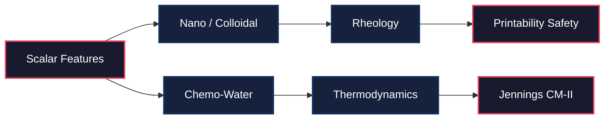

<!--
SPDX-License-Identifier: MIT
Copyright (c) 2026 Santhosh Shyamsundar, Santosh Prabhu Shenbagamoorthy — Studio TYTO
-->

# UMST Concrete Cartridge

### The First Thermodynamic Science Cartridge for the UMST Framework

**Pure Functional `burn` Tensors&ensp;·&ensp;Multi-Physics Constitutive Engine&ensp;·&ensp;Roussel Constraint Mapping&ensp;·&ensp;Jennings CM-II Hydration**

*`umst-concrete-cartridge` is the physical constitutive engine that mounts directly onto the UMST Manifold. Written entirely in pure, functional tensor operations, it maps topological scalar features into real-world concrete material behaviors.*

 

| | |
|:---:|:---:|
| **Multi-Physics Solvers** | 14 concurrent material science engines |
| **Fully Differentiable** | End-to-end continuous gradients via `burn` |
| **Topological Boundary Dispatch** | Solves exclusively over the Manifold $B_1$ edge vectors |

---

## Core Engine 

### Embedded Physics Models

The cartridge solves a highly non-linear, multi-physics interaction graph simultaneously across the Cellular Sheaf.

| Module | Core Physics | Output Tensors |
|--------|--------------|----------------|
| **Colloidal** | DLVO Theory, Zeta Potential | Flocculation Multiplier |
| **Rheology** | Chateau-Ovarlez, YODEL | Yield Stress, Viscosity |
| **Printability** | Roussel Constraints | Buildability, Extrudability |
| **Strength** | Jennings CM-II | Compressive Strength (MPa) |
| **Fracture** | Ulm Micromechanics | Fracture Toughness ($K_{Ic}$) |
| **Durability** | Transport, Freeze-Thaw | Diffusivity, Internal RH |
| **Lifecycle** | Creep, Autogenous Shrinkage | Compliance |

---

### Functional Topologies

The entire engine implements the `IScienceCartridge` trait. It completely bypasses dense 4D arrays, gathering and scattering heat, stress, and chemical flow strictly across the `$B_1$` edge matrices of the UMST Manifold to guarantee absolute mass and energy conservation.

---

## Connection to the UMST Programme

This repository is part of the **Foundations of Constitutional Physics (FCP)** series by [Studio TYTO](https://zenodo.org/communities/unified-material-state-tensors/). 

| Repository | Role |
|------------|------|
| [`umst-formal`](https://github.com/tytolabs/umst-formal) | Classical UMST formal proofs (Lean 4, Coq, Agda) |
| [`umst-manifold`](https://github.com/tytolabs/umst-manifold) | The pure Rust implementation of the mathematical framework |
| **`umst-concrete-cartridge`** (here) | The specialized constitutive engine for cementitious materials |

---

## Authors

**Santhosh Shyamsundar** — Studio TYTO; IAAC Barcelona · [santhoshshyamsundar@tyto.studio](mailto:santhoshshyamsundar@tyto.studio)

**Santosh Prabhu Shenbagamoorthy** — Studio TYTO; IAAC Barcelona · [santosh@tyto.studio](mailto:santosh@tyto.studio)

---

MIT License · © 2026 Studio TYTO · <a href="https://github.com/tytolabs">github.com/tytolabs</a>

